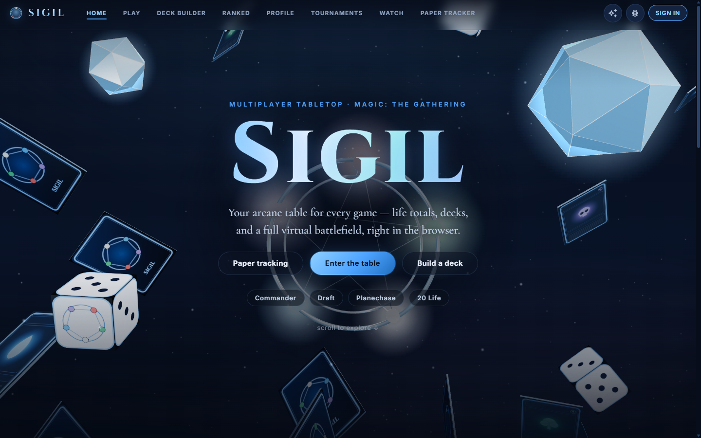
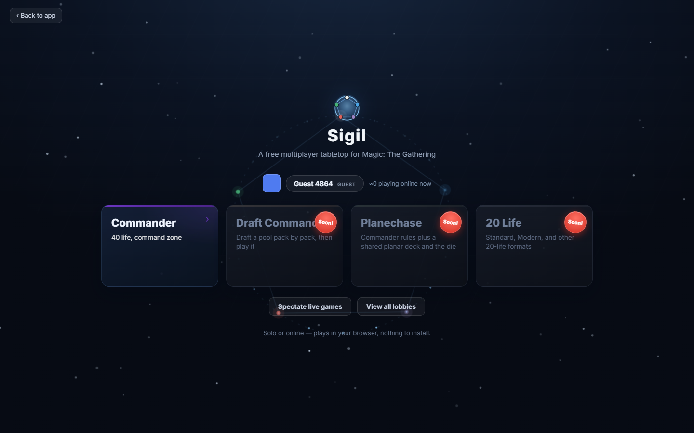

# Sigil — a multiplayer tabletop for Magic: The Gathering

**Your arcane table for every game — life totals, decks, and a full virtual battlefield, right in the browser.**

Sigil is a free web tabletop for playing and tracking Magic: solo goldfishing, hotseat pods, and online multiplayer with real hidden-zone enforcement — plus a deck builder, paper-game life tracker, and format extras like Planechase and Commander Draft. Vanilla JS, no build step: open `index.html` and play.



## The virtual tabletop

- **Solo / goldfish** — pan/zoom board, draw/play/tap/drag, every zone (library / hand / battlefield / graveyard / exile / command / stack), tokens, counters GUI, scry & surveil, London mulligan, clickable phase bar, undo, action log, double-faced flip, foil & alternate-print picker, and live +1/+1 / -1/-1 power-toughness math. Card art resolves automatically from Scryfall.
- **Pod (hotseat)** — seat 1–4 players as separate playmats in a spaced 2×2 grid, each with its own battlefield, piles, life, felt tint, and active-seat glow. *Pass turn* hands control to the next seat and reorients the board. Commander-damage matrix (21 = lethal) and match-history recording built in.
- **Online multiplayer** — sign in, host public/private games, find games in the lobby, or join by ID. Hidden zones are enforced by **Postgres Row-Level Security**, not the client — the server is the source of truth for what you're allowed to see (verified under two JWTs in `tests/rls_assertions.sql`).



## Beyond the table

- **Deck builder** — Scryfall search with autocomplete and filters, local saved decks, deck stats, validation warnings (commander totals, duplicates, format legality), favorites, and one-click import to the table. Paste lists from Moxfield / Archidekt / MTGA.
- **Paper tracker** — the original table tracker for in-person games: tap-and-hold life totals, source-aware commander damage, poison/energy/experience/storm and custom counters, dice, coin flips, random player, turn cycles, death overlays, and official rules-text search.
- **Formats & extras** — Planechase (planar deck + die), Commander Draft (draft a pool pack by pack, then play it), combat helper, deck insights (mana curve / colors / types), playmat backgrounds, save/load board, shareable playtest links.

## Architecture

The Play tab is deliberately boring technology — no framework, no bundler:

| Piece | Role |
|---|---|
| `table-core.js` | Pure, dependency-free reducer — `reduce(state, action)` with an exact `invert(action, state)` for undo round-trips and a deterministic seeded shuffle. 63 node-test assertions. |
| `table.js` | Renderer + input: pan/zoom, drag/tap, context menus, panels. |
| `table-sync.js` / `web-sync.js` | Supabase realtime multiplayer on top of the same action stream. |
| `backend/supabase/*.sql` | Schema, deck-builder extension, tabletop RLS, and lobby discovery. |
| `tests/table-smoke.cjs` | Headless jsdom harness — boots the Play tab, loads solo + a 4-player pod, opens every panel, asserts zero console errors. |

State flows one way: every game mutation is an action; online play appends the same actions through Supabase realtime, and RLS-filtered `game_card_instances` keep hidden information hidden at the database layer.

## Run it

```bash
# no build step — any static server works
npx serve .        # or just open index.html
```

The tabletop is fully usable offline. Online features need a Supabase project:

1. Run `backend/supabase/schema.sql`, `deck_builder.sql`, `tabletop.sql`, and `lobby_public_game_discovery.sql` in the SQL editor.
2. Enable email/password auth (plus Google / Apple OAuth if you want).
3. Copy `supabase-config.example.js` → `supabase-config.js` with your URL + anon key, and include it before `web-sync.js` in `index.html`.

`supabase-config.js` and `.env*` are gitignored; the `service_role` key lives only in Edge Function secrets.

**Tests:** `node tests/table-core.node.cjs` · `npm i jsdom && node tests/table-smoke.cjs`

## iOS

A SwiftUI scaffold in `ios/MTGTableTracker/` shares the web app's data contract (`shared/data-contract.md`) and Supabase schema, ready for Xcode assembly on a Mac — see the in-file setup notes.

---

*Sigil is unofficial Fan Content permitted under the Fan Content Policy. Not approved/endorsed by Wizards. Card data and imagery courtesy of Scryfall.*
