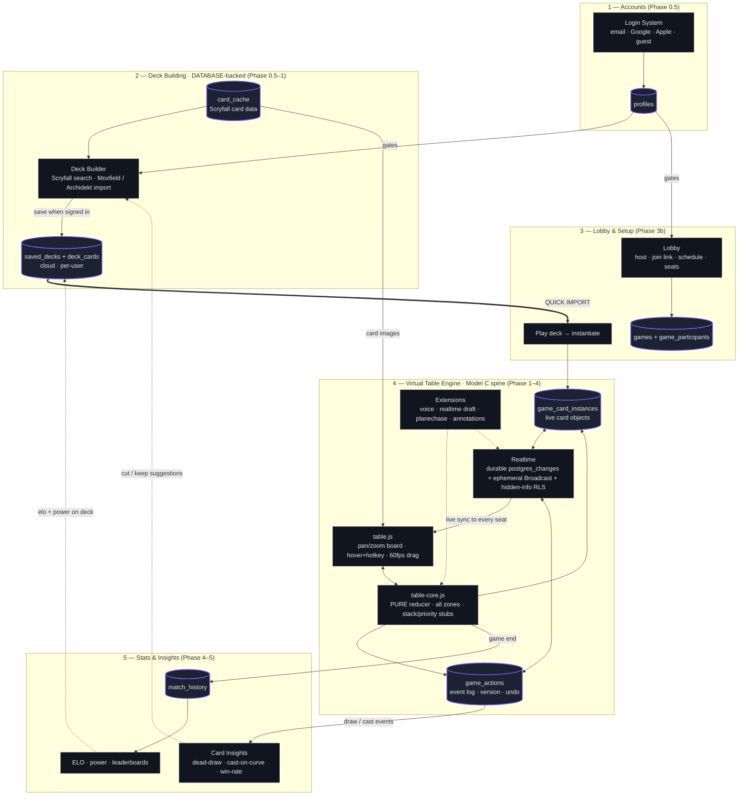

# Online MTG Virtual Tabletop — Implementation Plan

> A playgroup.gg-class online Magic: The Gathering experience: render real cards, drag/tap/untap, roll dice, make tokens, track commander damage & counters, and play full multiplayer Commander games in the browser.
>
> **Status:** Planning / for review. No code written yet.
> **Target repo:** New standalone app (directory TBD — you'll provide it).
> **Stack basis:** Reuses the proven patterns from `perform-app-build` (Next.js 14 App Router + Supabase + React Query + Tailwind), plus a new real-time game layer.
> **Platform:** Web first. iOS (Capacitor) deferred to a later phase.
>
> **⚠️ UPDATE (after reading the real codebase):** the target is the existing **`mtg-life-counter`** app — **vanilla JS + Supabase + a SwiftUI iOS app**, not a new Next.js project. The concrete, codebase-grounded build plan is **`MTG_TABLETOP_INTEGRATION_PLAN.md`**, which **supersedes the stack (§3) and realtime-transport (§5) sections below** (it's vanilla JS extending the existing Supabase `game_actions` event log, not Next.js/PartyKit). The product vision and the **Model C** engine-ready spine (§0–§0.1) still hold.

---

## ▶ EXECUTION GUIDE — start here

**To build this, work §23 (the execution checklist) top-to-bottom.** Each milestone M0–M16 maps to a `PROMPT` in `MTG_TABLETOP_INTEGRATION_PLAN.md` §14 — run the prompt, pass its **Gate** (the VERIFY block, §19), move on. That's the whole loop.

**Document precedence (when sections disagree, higher wins):**
1. `MTG_TABLETOP_INTEGRATION_PLAN.md` — the executable build (PROMPT 0–10, schema, RLS, fixes).
2. This plan **§15–§26** — current authoritative design (UI refs §21/§22, checklist §23, engine §24, comms §25, caching §26).
3. This plan **§0–§0.1** — the Model C strategy (still holds).
4. This plan **§1–§14** — the ORIGINAL generic vision; **read for concepts only.** Where it says **Next.js / React / PartyKit / dnd-kit / framer-motion / boardgame.io, IGNORE that** — the real stack is **vanilla JS (no build) + Supabase Realtime**, matching the existing `mtg-life-counter` codebase. §11's phases are superseded by §23.

**Resolved decisions (locked — no input needed):** Model C ✓ · vanilla JS + Supabase, no build ✓ · realtime = Supabase Realtime (Broadcast + postgres_changes), **not** PartyKit ✓ · hand-rolled `table-core.js` reducer ✓ · hidden info = RLS-per-subscriber + owner-only secret-identity table (Edge relay fallback; PROMPT 0 verifies) ✓ · guests = Supabase anonymous auth ✓ · server-authoritative RNG ✓ · `vitals.js` extraction (PROMPT 0.75) ✓ · `action_type` = TEXT, no enum ✓ · new dedicated Supabase project, one project until launch ✓ · monetization = non-commercial, never (§6) → no IP restrictions ✓ · format = Commander v1; 20-Life / Draft / Planechase as modes (M15) ✓ · iOS = web-first, contract extended now ✓ · OAuth = Email + Google now, Apple before iOS ✓ · UI feel = Playgroup PRIMARY (§22), Kiku secondary (§21) ✓.

**The ONLY inputs needed from you (everything else proceeds without you):**
1. **Voice TURN provider** — I'll prompt you with options at M11 (the ⏸ gate in §25).
2. **Web host** — default Cloudflare Pages / Netlify (any static host works); override if you prefer.
3. **Operational secrets you supply once:** Supabase URL + keys, `ANTHROPIC_API_KEY` (AI deck review), Google/Apple OAuth credentials, your domain. (Setup values, not design choices.)

---

## 0. The strategy: tabletop-first, rules-engine-ready (Model C) — READ FIRST

"All the rules of Commander" spans two products an order of magnitude apart in effort. Your instinct — ship the tabletop first, but build it so a rules engine can grow into it later — is the right one. That hybrid is **Model C**, and it's what this plan now targets.

| | **A. Virtual Tabletop** (manual) | **B. Automatic Rules Engine** | **C. Tabletop-first, engine-ready** ← chosen |
|---|---|---|---|
| Reference | Cockatrice / SpellTable | XMage / Forge / Arena | A's product + B's architecture |
| Software does | Zones, sync, render, drag/tap/dice/tokens/counters; players apply the rules | Knows what every card does; enforces stack, priority, triggers, SBAs, targeting, legality | Ships as A, but state model + event core + ability schema are built so automation can be added card-by-card with no rewrite |
| Card logic | None (image + metadata) | All ~31k cards scripted in code | Optional per card; **un-scripted cards just stay manual** |
| Realistic effort | Weeks → a few months for a strong v1 | XMage = 15-yr, 100s-of-devs project. Not replicable. | A's effort now + a small "engine spine" tax; automation is an open-ended later track |
| Ships a product? | ✅ | ❌ (never "done") | ✅ ships as A, improves forever |

**The decisive catch about "borrowing XMage's code": you can't lift it.** XMage is **99.9% Java**, desktop-only, **no web/JS layer**, with **~31,000 cards each hand-written as a Java class** ([repo](https://github.com/magefree/mage)). Forge is Java too. None of it runs in a Next.js/TypeScript browser app — "porting" means *reimplementing*. What you genuinely take from them is **design and specification, not code** (see §0.1).

**We ship Model A**, but pay a small **engine-ready spine** tax up front (§0.1) so Model B can grow in later. Automation itself is a long, open-ended track that begins only *after* the tabletop is turnkey-polished — it is never a v1 prerequisite, and any card without a script simply falls back to manual play on the same table.

> ⚠️ **Confirm on review:** ship A, build the engine-ready spine. Rules automation is a post-v1 track (§0.1 + §11 Track B), not a v1 deliverable.

---

## 0.1 The Model C spine — what makes B growable later

XMage's approach is wrong *for our stack*: behavior is **hardcoded in Java, per card**. The TS-native pattern to copy instead is **cards as pure data + a library of effect primitives** — the design behind *Argentum* (a Kotlin+TS engine whose author built a working MTG client in ~2 weeks precisely because card definitions are just data wiring engine primitives together). So the "skeleton" is six seams that are **cheap to add now and a rewrite to retrofit later**. We bake them in during Phases 2–3 while play is still 100% manual:

1. **Event-sourced authoritative core** (already in the plan). A rules engine is just a smarter reducer over the same event log. Build the log now; the engine slots in later.
2. **Rich `GameObject` model, not "an image at x,y."** Each object carries real characteristics — card types, P/T, loyalty, colors, `abilities[]`, counters, status (tapped/flipped/phased). The tabletop ignores most of these fields; the engine reads them. Adding them now is free; bolting them on later breaks everything that touched the old shape.
3. **First-class stack, priority, turn structure (phases/steps), and player state** in the state model — *represented even while play is manual*. Manual mode lets humans advance phases and put objects on the stack; the engine later drives the very same structures.
4. **Declarative ability/effect schema.** Cards may carry optional machine-readable behavior (e.g. `{ trigger:'etb', effect:'draw', n:1 }`) that references engine primitives. Day one, every card's behavior is empty → fully manual. You fill primitives in over time.
5. **Engine modules as no-op stubs:** the CR 613 **continuous-effects layer system**, the **state-based-actions** checker, and **targeting/legality**. They start as pass-throughs (manual play works fine); each is implemented incrementally without touching the UI.
6. **Engine ⟂ presentation split.** The tabletop renders state and emits *intents*; whether an action is human- or engine-generated, it flows through the same core. This is the seam that lets B appear without rebuilding A.

**What's actually reusable from XMage / Forge (reference, not import):**
- **Card-behavior spec** — their per-card Java classes are the most precise public statement of *what each card does*; read them when scripting a card.
- **Rules-interaction tests** — XMage's `Mage.Tests` encode correct rulings; reuse them as your engine's correctness spec.
- **Effect taxonomy & the 613 layer handling** — how they factor common effects is a battle-tested design to mirror in TS.

**TS-native references to study instead of XMage's code:** *Argentum* (cards-as-data + primitives, has TS), *mtghub-engine* (a rules DSL for custom cards/mechanics), and **boardgame.io** as a candidate substrate for the turn/multiplayer core. (Running XMage's Java server behind your web UI is **not** a shortcut — it speaks a bespoke Java-serialization protocol to its own Swing client; community web-client attempts have never yielded an embeddable engine.)

**Automation roadmap (post-v1, open-ended).** Most cards = a few hundred **templated effects** + **evergreen keyword abilities**. Implement the common primitives first and a small amount of engine code auto-covers a large share of real decks; everything unscripted stays manual. Suggested order: **SBAs + turn/phase engine → mana & casting → the stack & priority → templated ETB / triggered / activated effects → evergreen keywords (flying, trample, deathtouch, lifelink…) → the CR 613 layer system → the long tail (manual forever where needed).**

---

## 1. What we're building (and what we're not)

**Building:** A real-time, multiplayer, browser-based MTG digital tabletop focused on Commander (EDH), where 2–6 players each load a deck and play a full game with rendered cards they drag, tap, and manipulate.

**Not building (you already have these — we integrate, not rebuild):**
- ❌ The life/stats *paper tracker* — you've built it. We **feed match results into it**.
- ❌ A deck builder — you've built one. We **consume its decklists**.

So the scope of THIS app is the **engine + table + multiplayer + card data**, with two clean integration seams to your existing tools.

**Feature parity target with playgroup.gg's online side:**
- ✅ Online Commander play (the core)
- ✅ Render real cards, drag & drop between zones, tap/untap
- ✅ Life, commander damage matrix, poison, energy & arbitrary counters
- ✅ Dice rolling, coin flips, tokens, copies
- ✅ Library actions: shuffle, draw, scry, surveil, mill, search, reveal, mulligan (London)
- ✅ All zones: library, hand, battlefield, graveyard, exile, command zone, (optional) stack
- ✅ Lobby / game finder / invites / spectators
- ✅ In-game chat + action log
- ➕ Solo "goldfish" playtest mode (matches playgroup.gg's Solo Playtesting; also our dev harness)
- ⏳ Optional webcam/voice (WebRTC) — deferred, see Phase 5

---

## 2. Architecture overview

```
┌─────────────────────────── Browser (Next.js 14 / React) ───────────────────────────┐
│  Lobby UI   Deck import/picker   TABLETOP (zones, cards, drag/tap, dice, counters)   │
│        │                │                          │            ▲                    │
│        │ React Query    │ React Query              │ WebSocket  │ state snapshots    │
└────────┼────────────────┼──────────────────────────┼────────────┼────────────────────┘
         ▼                ▼                          ▼            │
   ┌──────────────────────────────┐        ┌─────────────────────┴───────────┐
   │   SUPABASE (system of record) │        │  REALTIME GAME LAYER (rooms)    │
   │  • Auth (existing pattern)    │◄──────►│  • Authoritative game state     │
   │  • profiles, decks, cards     │ persist│  • 1 room per game (2–6 players)│
   │  • games, game_players        │ results│  • Validates + broadcasts moves │
   │  • game_snapshots (resume)    │        │  • Presence, reconnect, spectate│
   │  • RLS on everything          │        │  PartyKit OR Colyseus OR        │
   └──────────────┬───────────────┘        │  Supabase Realtime (see §5)     │
                  │                          └─────────────────────────────────┘
                  ▼
   ┌──────────────────────────────┐
   │  SCRYFALL DATA PIPELINE       │
   │  • Daily bulk import → cards  │
   │  • Search API (autocomplete)  │
   │  • Card images via CDN cache  │
   └──────────────────────────────┘
```

**Two state planes — this separation is the key design idea:**
1. **Durable plane (Supabase):** identities, decks, the card database, match metadata & results, periodic game snapshots. Slow-changing, queried with React Query, protected by RLS — exactly the pattern already used across `perform-app-build`.
2. **Live plane (realtime room):** the fast-moving in-game state (every card's zone/position/tap/counters, each player's life). Lives in an authoritative room process, synced over WebSockets, snapshotted to Supabase for crash recovery and final results.

Mixing these (e.g., writing every card drag to Postgres) would be too slow and chatty; keeping them separate is what makes the table feel instant.

---

## 3. Tech stack

> **⚠️ SUPERSEDED — read for concepts only.** The real stack is **vanilla JS (no build step) + Supabase**, matching the `mtg-life-counter` codebase (see `MTG_TABLETOP_INTEGRATION_PLAN.md` §2 + the Execution Guide). **Ignore the Next.js / React / PartyKit / dnd-kit / framer-motion mentions below** — they're from the original generic draft.

**Reused from `perform-app-build` (keep the conventions):**
- Next.js 14.2 App Router, route group `app/(app)/` for authed pages, `app/auth/*` for auth, `middleware.ts` for protection.
- Supabase (`@supabase/ssr`): `lib/supabase-client.ts` (browser) + `lib/supabase-server.ts` (server); module-level `const supabase = createClient()` inside React Query hooks (`hooks/*`).
- RLS on every table (`enable row level security` + `auth.uid()` policies; global read-only tables via a public `select` policy — same trick as `food_catalog.is_global`).
- TanStack React Query for all server state; `react-hot-toast`; Tailwind 3.4 custom dark theme + component classes (`card`, `btn-primary`, etc.); `lucide-react`.
- `next.config.mjs` security headers + metadata; Capacitor wrapper later for iOS.

**New for this project:**
- **Real-time game layer** — one of: **PartyKit** (recommended), **Colyseus**, or **Supabase Realtime** (see §5 for the trade-off and recommendation).
- **Card rendering & interaction** — React + a pointer-based drag system. `@dnd-kit/core` for zone-to-zone drops; custom transform-based drag for free positioning + tap (rotate 90°) on the battlefield. `framer-motion` (already in the stack) for card motion.
- **Scryfall** — bulk data importer (Node script / scheduled function) + thin search proxy. No SDK needed; it's a plain REST/JSON API.
- **State/event modeling** — an event-sourced reducer shared by client & room server (a small TypeScript package: `game-core`) so both sides apply moves identically.

---

## 4. Data model (Supabase)

All tables RLS-protected. `cards` is a global read-only catalog (public `select`, writes only via service-role importer).

```sql
-- Global card catalog, seeded from Scryfall bulk data (read-only to users)
cards (
  id uuid pk,                    -- our id
  scryfall_id text unique,
  oracle_id text,                -- groups reprints / same Oracle text
  name text not null,
  mana_cost text,
  cmc numeric,
  type_line text,
  oracle_text text,
  power text, toughness text, loyalty text,
  colors text[],                 -- W U B R G
  color_identity text[],         -- for Commander legality
  layout text,                   -- normal | transform | modal_dfc | split | ...
  image_small text, image_normal text, image_large text, image_png text,
  card_faces jsonb,              -- DFC / split faces
  set_code text, collector_number text, rarity text,
  is_legal_commander boolean,    -- precomputed convenience
  updated_at timestamptz
)

-- Decks consumed from the existing deck builder (or imported by URL/text)
decks (
  id uuid pk, user_id uuid -> profiles,
  name text, format text default 'commander',
  commander_card_id uuid -> cards, partner_card_id uuid -> cards null,
  color_identity text[],         -- derived from commander(s)
  source text,                   -- 'builder' | 'moxfield' | 'archidekt' | 'text'
  source_ref text,               -- url/import id for re-sync
  created_at, updated_at
)
deck_cards (
  id uuid pk, deck_id uuid -> decks, card_id uuid -> cards,
  quantity int default 1,
  board text default 'main'      -- main | commander | maybe | sideboard
)

-- A match / table
games (
  id uuid pk, host_id uuid -> profiles,
  format text default 'commander',
  status text default 'lobby',   -- lobby | active | finished | abandoned
  settings jsonb,                -- starting life, rules toggles, automation flags
  rng_seed text,                 -- deterministic shuffles/dice for replay
  winner_player_id uuid null,
  created_at, started_at, ended_at
)
game_players (
  id uuid pk, game_id uuid -> games,
  user_id uuid -> profiles null, -- null = guest
  guest_name text null,
  seat int,                      -- 0..5
  deck_id uuid -> decks null,
  starting_life int default 40,
  final_place int null,          -- for stats/ELO handoff
  commander_damage jsonb         -- { fromSeat: amount } snapshot at end
)

-- Crash-recovery + replay snapshots of the live plane
game_snapshots (
  id uuid pk, game_id uuid -> games,
  version int,                   -- last applied event seq
  state jsonb,                   -- full serialized game state
  created_at
)
```

**In-game card object (lives in the realtime room state, not a table):**
```ts
type CardInstance = {
  instanceId: string;        // unique per physical copy in this game
  cardId: string;            // -> cards.scryfall_id
  ownerSeat: number;         // who it belongs to (deck owner)
  controllerSeat: number;    // who currently controls it
  zone: 'library'|'hand'|'battlefield'|'graveyard'|'exile'|'command'|'stack';
  x?: number; y?: number;    // battlefield position (% of board, responsive)
  z?: number;                // stacking order
  tapped: boolean;
  faceDown: boolean;
  flipped: boolean;          // DFC/transform face index
  counters: Record<string, number>;  // {'+1/+1': 3, 'loyalty': 5, ...}
  attachedTo?: string;       // auras/equipment -> instanceId
  isToken: boolean;
  isCommander: boolean;
};
```

---

## 5. Real-time game-state design

### 5.1 Transport choice (decide on review)

| Option | Pros | Cons | Verdict |
|---|---|---|---|
| **PartyKit** (Cloudflare Durable Objects) | Purpose-built for multiplayer rooms; 1 room = 1 stateful object; great DX; pairs cleanly with Vercel/Next; auto-scales | Separate deploy target; newer | **Recommended** |
| **Colyseus** (Node game server) | Authoritative state schema, rooms, matchmaking, reconnection built-in; very game-oriented | Needs a persistent host (Fly.io/Railway/Render), not serverless | Strong alt if you want classic game-server ergonomics |
| **Supabase Realtime** (Broadcast + Presence) | Zero new infra; stays 100% in current stack | You build authoritativeness yourself; client-authoritative + last-write-wins; weaker for complex state | MVP-only fallback |

**Recommendation: PartyKit** for a serious product, **Supabase Realtime** acceptable for an early MVP to avoid new infra. The `game-core` reducer is written transport-agnostically so we can swap later without rewriting game logic.

### 5.2 Event-sourced action protocol

Every player action is an **event**. The room server is authoritative: it validates minimally (is it your card? is the move structurally legal?), assigns a monotonic `seq`, applies it to state, and broadcasts to all clients + spectators. Clients hold a local copy and apply the same reducer → identical state everywhere.

```ts
type GameEvent =
  | { t:'MOVE_CARD'; instanceId; toZone; x?; y?; index? }
  | { t:'TAP'; instanceId; tapped }
  | { t:'SET_LIFE'; seat; value } | { t:'ADJUST_LIFE'; seat; delta }
  | { t:'CMDR_DAMAGE'; fromSeat; toSeat; value }
  | { t:'COUNTER'; instanceId; kind; delta }
  | { t:'CREATE_TOKEN'; cardId?; tokenDef?; ownerSeat; x; y }
  | { t:'DRAW'; seat; count } | { t:'MILL'; seat; count }
  | { t:'SHUFFLE'; seat } | { t:'SCRY'; seat; order }
  | { t:'MULLIGAN'; seat; keep }
  | { t:'REVEAL'; instanceIds; toSeats }
  | { t:'ROLL_DICE'; sides; count; actorSeat } | { t:'FLIP_COIN'; actorSeat }
  | { t:'PASS_TURN'; toSeat } | { t:'UNTAP_ALL'; seat }
  | { t:'CHAT'; actorSeat; text };
```

- **Determinism:** shuffles/dice use the game's `rng_seed` so the server is the source of randomness and everything is replayable.
- **Hidden information:** library order and hand contents are filtered per-recipient by the server (you don't broadcast a player's hand to opponents). Each client receives only what it's entitled to see.
- **Snapshots:** server persists a `game_snapshots` row every N events (and on disconnects). Reconnect = fetch latest snapshot + replay the tail.
- **Reconnect/resume:** rejoin the room, server replays full filtered state. Matches playgroup.gg's "resume if interrupted."
- **Spectators:** read-only subscribers; see all public zones, not hidden hands.

### 5.3 Optional convenience automation (toggleable per game)
Auto-untap your permanents at turn start • auto-draw for turn • commander-tax counter (+2 each cast) • commander-damage auto-loss reminder at 21 • token search via Scryfall • "did you trigger?" reminders. None of these enforce card text — they're quality-of-life, off by default for purists.

---

## 6. Scryfall card-data pipeline

- **Bulk import (primary):** download Scryfall **Default Cards** / **Oracle Cards** bulk JSON (updated daily), transform → upsert into `cards`. Run as a scheduled job (cron/edge function) so the catalog stays current with new sets. ~30–90k rows depending on bulk set chosen.
- **Search API (interactive):** thin server proxy to Scryfall `/cards/search` + `/cards/autocomplete` for deck import and token lookup, with our own result cache. Respect their rate limit (~10 req/s, 50–100 ms between calls) and send a proper `User-Agent`.
- **Images:** Scryfall asks consumers to **cache images rather than hotlink at scale**. Strategy: store Scryfall image URLs in `cards`, serve through our CDN/image cache (Vercel image optimization, Supabase Storage, or Cloudflare) and lazy-load. Use `small` for piles, `normal` for hand/battlefield, `large`/`png` for hover-zoom. Preload a deck's images when a game starts.
- **DFC/split/adventure:** keep `card_faces` + `layout` so the table can flip/transform correctly.

> ⚖️ **IP / content posture — DECISION: non-commercial, never monetized.** The site will **not** be monetized (no paid tiers, subscriptions, or ads), so it runs as a **non-commercial fan tool** under WotC's **Fan Content Policy** — the same footing as Cockatrice / XMage / Untap. That removes the licensing blocker and the paid-tier concern entirely; there are **no restrictions on rendering card images/art for play**. Two lightweight obligations remain regardless of monetization, and we'd do both anyway: (1) **Scryfall API etiquette** — cache images rather than hotlink at scale, send a proper `User-Agent`, respect rate limits (this is just good engineering for `card_cache`); (2) show the **standard Fan Content disclaimer** ("Unofficial Fan Content permitted under the Fan Content Policy. Not approved/endorsed by Wizards. Portions are property of Wizards of the Coast."). Card art remains © WotC/artists — non-commercial use is tolerated, not "owned." **Revisit this only if monetization is ever reconsidered.**

---

## 7. Functional requirements

**Cards & table**
- Render any card from `cards` with correct face, art, and metadata; hover/long-press to zoom.
- Drag a card between any zones; free-position on the battlefield; stack/group piles.
- Tap/untap (rotate 90°); flip face-down; transform DFCs; attach auras/equipment.
- Add/remove arbitrary counters with badges; quick buttons for +1/+1, loyalty, poison, energy.
- Create tokens (from Scryfall token search or a custom token definition) and copies.

**Zones**
- Library: face-down stack w/ count; draw, mill, scry(N), surveil, search (browse + pull), shuffle, reveal top.
- Hand: private to owner (count visible to others), fan layout, play to battlefield/stack/zone.
- Battlefield: free-form positioning, lands/nonland grouping optional, multi-select move.
- Graveyard / Exile: face-up browsable piles.
- Command zone: commanders, commander-tax counter, recast.
- Stack (optional manual mode): represent spells/abilities in order.

**Player & game vitals**
- Life (start configurable, default 40), ±1/±5 quick controls.
- Commander damage matrix (damage from each commander to each player; 21 → loss reminder).
- Poison (10 → loss reminder), energy, experience, and custom counters.
- Dice (d2/d6/d20/custom), coin flips, shared visible results in the log.
- Turn passing + whose-turn indicator; optional turn timer.

**Multiplayer & session**
- Lobby: create game, set format/life/automation toggles, invite link, seat assignment.
- Deck selection from the user's decks (imported from the existing builder) or quick import.
- Game finder: list of open public tables to join; private invite codes.
- Guests can join without an account (matches playgroup.gg); spectators read-only.
- Reconnect/resume; in-game chat + scrollable action log.
- Game end: declare winner/placement → write `game_players.final_place` + results handoff to the existing tracker/stats system.

**Solo mode**
- Single-player goldfish/playtest table with all the above (no networking) — both a product feature and our primary dev/test harness.

---

## 8. Non-functional requirements

- **Latency:** card actions reflected for all players in <150 ms on a normal connection; optimistic local apply + server reconcile.
- **Consistency:** authoritative server seq ordering; clients converge; no desync after reconnect.
- **Performance:** smooth with 6 players × ~100-card decks; lazy-load images, virtualize big piles, GPU transforms for drag/tap.
- **Security:** RLS on all Supabase tables; hidden-info filtering server-side (never trust the client with opponents' libraries/hands); room membership checks; service-role only for the Scryfall importer.
- **Resilience:** snapshot + replay; graceful host-leave (migrate host or pause).
- **Accessibility:** keyboard shortcuts for common actions, focus states, reduced-motion respect (pattern already in the app).
- **Responsive/mobile-web** now; **native iOS via Capacitor** later (the existing repo already proves this path).

---

## 9. UI / UX

- **Table layout:** your area anchored bottom (hand fanned, battlefield above it); opponents arranged around the table in panels showing avatar, life, commander-damage received, counters, and a zoomable mini-battlefield. 1v1 and 4-player Commander layouts.
- **Card interactions:** click = select; drag = move; double-click/space = tap; right-click/long-press = context menu (move to zone, add counter, clone, reveal, flip, attach); hover = zoom preview.
- **Quick bars:** per-player life/counter controls; global dice/coin; library action menu; untap-all/draw-for-turn buttons.
- **Log & chat:** combined right rail; every event is human-readable ("Seat 2 drew 1, tapped Sol Ring, rolled d20 → 17").
- **Theming:** reuse the existing Tailwind dark theme tokens & component classes for instant visual consistency.

---

## 10. Integration seams (your existing tools)

1. **Deck builder → tabletop:** define a decklist contract (the existing builder exports `{ commander, cards:[{name|scryfall_id, qty, board}] }`). We resolve names → `cards`, validate Commander color identity & singleton, and store in `decks`/`deck_cards`. Also support pasted text + Moxfield/Archidekt URL import as fallbacks.
2. **Tabletop → tracker/stats:** on game end, emit a normalized result (`{ gameId, players:[{userId, seat, deckId, place, commanderDamageDealt, kills }], turns, durationSec }`) to the existing tracker so ELO/win-rate/power-level all keep working off real online games. Define this as a typed event/endpoint so both products stay decoupled.

> These two contracts are worth nailing down on review since they bridge three codebases (deck builder, this app, tracker).

---

## 11. Phased delivery plan

> **⚠️ SUPERSEDED by §23** (the execution checklist) + the integration plan's `PROMPT 0–10`. The phases below are the original generic outline; **build from §23, not here.** (Kept for the high-level shape only.)

Each phase ends in something runnable and verifiable.

**Phase 0 — Foundations (scaffold + card data)**
- New repo scaffolded with the reused stack (Next 14, Supabase clients, RLS, Tailwind theme, auth borrowed from existing patterns).
- `cards` table + Scryfall bulk importer + search proxy.
- Card component (render, faces, hover-zoom) + a card-search box.
- ✅ Verify: search "Sol Ring," see the rendered card with correct art/metadata.

**Phase 1 — Decks**
- Decklist contract + importer (text + URL + builder export); `decks`/`deck_cards`; commander & color-identity derivation/validation; deck viewer.
- ✅ Verify: import a 100-card Commander deck; it validates and renders all cards.

**Phase 2 — Solo tabletop (the engine, no network yet)**
- `game-core` event reducer + `CardInstance` state; all zones; draw/play/move/tap/untap/counters/tokens/dice/shuffle/scry/mulligan/life/commander-damage; battlefield free-positioning; context menus; action log.
- **Engine-ready spine (Model C):** model objects as rich `GameObject`s and give state a first-class stack / priority / turn-structure / player-state, with the layer-system, SBA, and targeting modules present as no-op stubs (§0.1). All play stays manual now; nothing here needs rework to automate later.
- ✅ Verify: play a full goldfish turn cycle solo — every action works and the log is correct.

**Phase 3 — Real-time multiplayer**
- Stand up the realtime room (PartyKit recommended); wire `game-core` to events; presence, hidden-info filtering, optimistic apply + reconcile, reconnect/snapshots; lobby + invite + seats; spectators; chat.
- Start at 2 players, then 4-player Commander layout.
- ✅ Verify: two browsers play the same game live; refresh one mid-game and it resumes correctly.

**Phase 4 — Commander layer + results handoff**
- Command zone, commander tax, commander-damage matrix + loss reminders, color-identity-aware deck loading; game-end flow → results event to the tracker/stats.
- Optional convenience-automation toggles.
- ✅ Verify: full 4-player Commander game start→finish; result lands in the tracker.

**Phase 5 — Online-play extras & platform (deferred)**
- Public game finder, richer spectating, polish, mobile-web tuning; **optional** WebRTC webcam/voice tables; then **iOS via Capacitor**.

**Track B — Incremental rules automation (post-v1, open-ended)**
- Starts only once the tabletop is turnkey-polished. Follows the §0.1 order: SBAs + turn/phase engine → mana & casting → stack & priority → templated ETB/triggered/activated effects → evergreen keywords → CR 613 layers → long tail. Every unscripted card falls back to manual on the same table, so this track never blocks shipping or play.

---

## 12. Risks & mitigations

| Risk | Mitigation |
|---|---|
| Scope creep into auto rules-enforcement | Ship the manual tabletop (Model C); the engine is Track B (§24) — card-by-card, toggled, never blocking |
| Real-time desync/latency | Event-sourcing + authoritative seq + snapshots + reconnect tests from Phase 3 |
| Hidden-info leaks (cheating) | Server-side per-recipient filtering; never ship opponents' hidden zones to the client |
| Scryfall rate limits / image hosting | Bulk import + CDN image cache + lazy load; proper User-Agent & throttling |
| Legal/IP — **resolved: non-commercial** | Never monetized → non-commercial fan tool under WotC Fan Content Policy; **no restrictions on card imagery for play**. Only obligations: Scryfall API etiquette + a fan-content disclaimer (§6). Revisit only if monetization is ever added. |
| Realtime infra | **Supabase Realtime** (Broadcast + postgres_changes) is the locked transport (already in the codebase); the `table-core` reducer stays transport-agnostic |
| Performance with 600+ card images | Virtualized piles, GPU transforms, image-size tiers, deck preloading |

---

## 13. Decisions — RESOLVED (defaults locked)

1. **Model C — LOCKED.** Ship the manual tabletop; engine = Track B (§24).
2. **Realtime transport — LOCKED: Supabase Realtime** (Broadcast + postgres_changes), not PartyKit/Colyseus (matches the existing stack; integration §2/§5).
3. **Deck builder + tracker — RESOLVED:** both live in the **same `mtg-life-counter` codebase**; decks move localStorage → Supabase (integration §6.5B); stats handoff = `match_history` (integration §8). No external contracts needed.
4. **Monetization/legal — DECIDED: non-commercial, never** (§6) → no IP/imagery restrictions; only Scryfall etiquette + a disclaimer.
5. **Format scope — DECIDED:** Commander v1; **20-Life / Draft / Planechase** as additional modes (built in §23 M15), mirroring Kiku/Playgroup.
6. **Supabase project — DECIDED:** new dedicated project; one project until launch, then split.
7. **Engine substrate — DECIDED:** hand-rolled `table-core.js` reducer (not boardgame.io) — full control over the §0.1/§24 spine.

> All locked with defaults so the build runs without you. The only live inputs are in the **Execution Guide** (top): voice TURN provider (⏸ at M11), web host, and operational secrets.

---

## 14. Recommended next steps (for the build chat)

1. Bring the `mtg-life-counter` repo into the cowork build chat (with the three plan docs in `/docs` + the `ui-reference/` images).
2. Start at **§23 → M0**, then run each milestone's `PROMPT` (integration §14) to its **Gate** (VERIFY, §19).
3. The only inputs needed from you are the three in the **Execution Guide** (voice TURN at M11, web host, operational secrets). Everything else is locked (§13).

---

## 15. Competitive teardown findings — Kiku.gg + Playgroup Live (2026-06-22)

A 3-agent study (Kiku.gg, Playgroup Live, open-source VTTs). **Full feature lists, the decompiled Kiku protocol, and a vanilla-JS/SQL code-snippet library live in `MTG_VTT_RESEARCH_LOG.md`** — read it before building. Highlights that change this plan:

**Confirmed competitor architectures.** Kiku's shipped JS bundle decompiles to **Colyseus (authoritative WebSocket rooms) + PixiJS (WebGL) + zustand**, Scryfall direct. Playgroup Live is **server-authoritative** ("the server keeps hidden zones hidden"). Both reject honor-system hidden info.

**Decisions now locked:**
1. **Hidden-info spike RESOLVED (the big one):** Supabase `postgres_changes` **enforces RLS per-subscriber** (confirmed via Supabase's own "Realtime RLS" writeup) → owner-only RLS on hand/library rows means opponents literally can't receive them. Ship **RLS-filtered realtime**; Edge relay is now just a fallback. (Verify only the column-nulling *view* variant in the Phase-0 spike.)
2. **Stay on Supabase** (not Colyseus/PartyKit) — confirmed sufficient; v2 fan-out path = **broadcast-from-DB on private channels**.
3. **Adopt Kiku's hover + single-key interaction model** as the PRIMARY UX (full keymap in the log: `t`ap/`f`lip/`a` transform/`x` token-copy/`c`ounter/`h g e l b` zone moves/`p`lay/`r` "I have a response"/Space pass). Right-click menu = discoverable fallback. This is the biggest UX upgrade over the old plan.
4. **Single pan/zoom shared board** (scales cleanly to 8 players) with per-seat playmat regions — replaces the fixed seat-panel layout in §9/§11.
5. **DOM-render first** (no-build), **PixiJS-via-CDN escape hatch** for 8×100-card perf — stress-test 8 players early.
6. **Hand-roll the interaction layer** (camera/drag/marquee/arrows) — virtualtabletop proves it in plain JS; no-build libs are React-only or fight %-coords.
7. **Log analytics from day 1:** stamp `turn` on every action + emit `opening_hand{card_names[]}` and `cast_spell` — or Card Insights (dead-draw / cast-on-curve / win-rate-impact / best-opener) is **impossible to backfill**.

**New features to add to scope (net-new from the teardown):** realtime **Commander Draft** (Kiku's flagship moat — weighted pool: popular/sweet-spot/deep-cuts + synergy phase + timers + bot seats), **Planechase** (custom/random planes), **custom playmats**, **free annotations** (text labels + mana counters), **attachment + target arrows**, **"announce response / pass turn"** social signals, **per-player reveals + group-exile piles** (the face-down gap), **exact-print + foil import**, guest **"claim game"** funnel, **ELO leech** + power/competitive-rating formulas, public **metagame** (Meta Diversity Index), a **"pure tabletop" ranked opt-out**, and heartbeat/reconnect. Consolidated tables/columns/action-types are in the research log (Part D).

**Corrections to integration-plan §13** (detail in log Part B4): the "every Commander rule handled automatically" framing over-claims (it's structural bookkeeping = our Model C); face-down needs per-player reveals + piles, not one boolean; spectators are unconfirmed, not parity; phase-out must skip untap; the attachment shelf needs ordering; Card Insights needs the day-1 logging above.

**Where we beat each:** vs **Kiku** — accounts, cloud cross-device decks, stats/ELO/leagues, scheduling, Discord/API, iOS, the Model C engine-ready spine (Kiku is accountless/ephemeral, no stats, no voice, desktop-only). vs **Playgroup** — it's mid-beta; our offline mode is nearly free given the event log. Kiku's **realtime draft** is the one feature neither our plan nor Playgroup had — strongly worth building as a differentiator.

---

## 16. End-to-end implementation & data-flow chart

The whole engine as **one continuous pipeline** — every feature and every row flows unbroken from login → deck → game → engine → stats → and back into the deck. **Locked decision (your call): deck building is database-backed.** Decks move from today's `localStorage` into Supabase **`saved_decks` + `deck_cards`**, gated by the new login system, so a signed-in user's decks are cloud-saved and **one-click importable into any game**. The DB-backed deck is the hinge between "build" and "play" (mechanics: integration-plan §6.5B). 🟪 = persistent data (DB/table); ⬛ = code/process.



**Data continuity — start → finish (the closed loop):**
1. **Login** (Supabase Auth) → `profiles`; gates everything. Guests use anonymous auth.
2. **Build a deck** — Scryfall / Moxfield / Archidekt; cards resolve through `card_cache`. **Save → `saved_decks` + `deck_cards` (cloud).** ← the DB change.
3. **Host/join a lobby** → `games` + `game_participants` (seats; public/private/scheduled).
4. **Play deck** → the saved deck is instantiated into `game_card_instances` (library + command zone) — the one-click import.
5. **Play** — `table.js` (board, hover+hotkey, drag) drives `table-core.js` (pure reducer, all zones, Model C spine); every move commits to `game_actions` + updates `game_card_instances`.
6. **Sync** — Realtime fans state to all seats: durable `postgres_changes` for committed moves, ephemeral Broadcast for the 60fps hot path, RLS for hidden zones. Voice / draft / planechase / annotations hang off the same core.
7. **Game ends** → `match_history`.
8. **Stats flow back** — ELO/power/leaderboards from `match_history`; Card Insights computed off the `game_actions` log (requires the day-1 `turn`/`opening_hand`/`cast_spell` logging, §15).
9. **Loop closes** — insights + deck ELO/power flow **back into the deck builder**, so playing makes your decks better. Repeat from step 2.

**Build-order overlay:** the chart *is* the build sequence — Accounts + DB decks (P0.5) → card render + board (P1) → engine reducer (P2) → realtime + lobby (P3) → Commander + stats handoff (P4) → Insights/draft/planechase (P5–P9). The `PROMPT 0–9` playbook in integration-plan §14 executes it bottom-up, left-to-right.

---

## 17. UI, menus & "feel" — match Kiku + Playgroup

The app must *feel* like both products. They are actually **two visual registers** — build both (full palettes, keymaps, menu item-lists in `MTG_VTT_RESEARCH_LOG.md` Part G):

- **Light, data-dense chrome** (Playgroup's stats/lobby surfaces: near-white bg, teal accent, rounded tiles, tabbed rank tables, "N Entries").
- **Dark, art-forward board** (the table: the player's **commander art is the seat background** + a scrim so vitals read; cards pop on near-black). → a **2-scope CSS-custom-property system**: `:root` light tokens for chrome, a `.table` dark scope for the board.

**Paste-in "feels like Kiku" (near-free):** Kiku's confirmed in-game palette (`--bg-primary:#111827 … --accent-blue:#3b82f6`, full block in Part G) + **6 land-named themes** via `data-theme` (Wastes/Plains/Island/Swamp/Mountain/Forest) that swap bg + accent. Playgroup's named themes (Art Deco…Pixel RPG) reskin only frames/borders/buttons — same pattern. System font stack; **monospace for life totals / timers / decklists**.

**Interaction model = Kiku's hover + single-key (adopt as PRIMARY).** Hover a card, press one key. Full **16-key map** (verbatim hint strings in Part G): `t` tap · `f` flip · `a` transform · `h/g/e` hand/grave/exile · `l/b` top/bottom of library · `c` counter@cursor · `x` token-copy · `d` draw · `m` morph (play face-down) · `p` play · `r` "I have a response" · `↑/↓` life · `Del` delete counter · `Space` pass · `Esc/Enter` cancel/confirm. Right-click = discoverable fallback rendered as an **icon-grid action menu** (Playgroup 4.0 direction), not a text list.

**Four context menus (exact item order in Part G):** battlefield card (16 items incl. Transform / Attach / Change Print / counter sub-controls), hand card (Place / Quick Play / Discard / Exile), empty board (Create Token/Counter/**Mana Floater**/Label + **Quick Tokens** Treasure/Food/Clue/Blood), zone-viewer card (**Reveal vs Hidden** variant on *every* move). Library pile menu (Draw X / Mill / Scry / Surveil / Search / Look at Top / Reveal Top / Exile Top / Shuffle…). Dice menu **d20-first**.

**In-game HUD = floating glass overlays, NO top bar.** Per-seat panel: commander-art bg + life (mono) + source-aware **commander-damage matrix** (21 = loss) + poison + counters + **"win-chance %"** + a **bracket details** panel; **attachment shelf** docked under the host; ephemeral **target arrows** (SVG inside the scaled surface); dedicated **Stack** zone; piles = stack + count badge; **docked resizable action log** (per-player colors, hover-card preview); chat = floating input + ephemeral board bubbles. **Small screen:** collapse CMG/poison into a center-FAB overlay.

**Preferences modal (Kiku's exact 5 sections):** Theme · **Card Language** (11 langs, Scryfall `lang:`) · Board (**Snap-to-grid**) · Sound (**SFX + volume**) · Keybindings reference. Optional juice: opt-in **particle burst on life-change**.

**Lobby / Rule-0 flow:** mode pick (Commander / Draft / Planechase / 20-Life) → create lobby (**invite link = the game URL**) → deck pick (Saved / Precon / Import) → **Rule-0 pre-game** (pick decks → choose starting player; show win-chance + bracket) → board. **Find-a-Game:** public lobby list + empty-state (Discord LFG / Host / Schedule funnels) + scheduled games (7 days); lobby cards carry host, deck, **inline-expandable primer**, bracket + power filters.

**Motion:** `fade-in`, `fade-in-up` (staggered .05–.4s), `slide-down` (menus), `ping/pulse` (your-turn / low-life); tap = `rotate(90deg) .12s`. Functional + smooth ("readable even when busy").

---

## 18. Art / printing / foil selector (requested feature)

One modal, **5 entry points**: (A) deck-builder card → choose print/art · (B) commander art → seat background · (C) in-game card right-click **"Change art/print"** · (D) custom playmat (image URL or any `art_crop`) · (E) tokens.

**Reuse, don't rebuild:** the deck builder **already has** an art picker (`deckImageModal`, `fetchDeckCardPrints`, `renderDeckArtPicker`, `selectDeckEntryArt` in `deck-builder.js`). EXTEND it: add **print mode** (`unique=prints` — don't collapse to art), a **set filter**, **Foil/Etched toggles** (derive from the print's `finishes[]`, auto-disable when absent), and a **DFC face flip**. The in-game picker is greenfield (no `table.js` yet).

**Scryfall (live-verified, Part G has queries):** `search?unique=cards|art|prints` (Lightning Bolt = 2 / 29 / 64); per-print fields `id, set, collector_number, finishes[] (nonfoil|foil|etched), frame_effects, prices`; DFC art lives in `card_faces[].image_uris`; exact-print resolve via `/cards/:set/:num` or batch `/cards/collection` (≤75; `{set,collector_number}` or `{name}`). **Foil/etched = client-side CSS shimmer** (Scryfall serves no foil image).

**Data model — store the chosen print in TWO layers:** `deck_cards` (+ `chosen_scryfall_id, set_code, collector_number, is_foil, is_etched, flipped_face`) = the default a card *enters the game with*; `game_card_instances` (`is_foil/is_etched/set_code/collector_number` already in the deltas; `scryfall_id` = the print; `flipped_face` = DFC) = a mid-game re-skin without mutating the saved deck. `card_cache` + `finishes text[]`. Multiplayer = a new **`card_setart`** action (validate owner/controller; optional `applyToAllCopies`; commit to `game_actions`; broadcast). **Fix `normalizeCard`/`normalizeSavedCard`** — they currently DROP `set/collector/finishes`, so even today a chosen print isn't remembered across reload.

> **Critical fix (art):** the deck→game loader must resolve cards by **`chosen_scryfall_id`** (or `{set,collector}` via `/cards/collection`) and copy `is_foil/etched/face` onto the new instances. The plan currently resolves by **name**, which silently discards the player's chosen printing. Full render fn + `card_setart` reducer + foil CSS + cache/resolve helpers are in Part G.

---

## 19. Build-readiness, QA & bug-testing protocol — "bug-tested before implemented"

**The architecture is a gift for testing:** `table-core.js` is a **pure `(state, action) → state` reducer** with no DOM/network → trivially testable with **zero new tooling**. Test layers (no build step):

1. **Pure-reducer harness — `tests/table-core.test.html`** (static page, no deps, opened via the preview tool). Asserts every action; the load-bearing property test is **`reduce(s, invert(a, s))` deep-equals `s`** (undo round-trip) for *every* action; plus **determinism** (seeded shuffle/dice identical; replaying an action list from `init` twice → identical state — the multiplayer-convergence guarantee), reducer **never throws** on unknown actions, and `viewFor(state, seat)` **strips opponents' hidden identities**. Encode the result in `document.title` ("PASS (n)" / "FAIL (n)") so an agent reads it via `preview_eval('document.title')`.
2. **RLS/SQL — `tests/rls_assertions.sql`**, run under **two JWTs** (player + opponent) via the Supabase MCP `execute_sql`. Assert: opponent reads **0** of A's hand rows **and** a face-down battlefield card's identity columns are NULL; `zone_counts` still shows "7"; a **guest (anon) can `appendAction`** without an FK error. **This is the real hidden-info spike** (it tests face-down identity + counts + guest FK, not just hands).
3. **Realtime smoke — `tests/realtime_smoke.html`**: two sessions; an action propagates to client B; **no hidden-zone leak**; an induced version-gap triggers **resync**, not divergence.
4. **UI smoke**: preview tool loads `index.html`, exercises the feature end-to-end, screenshots, asserts **zero console errors**. Plus the **8-player DOM stress test** (inject ~800 card nodes, measure a drag frame) to settle DOM-vs-PixiJS *with data* before the renderer locks.
5. **Optional later:** Vitest scoped **only** to `table-core.js` if a build step is ever added (`devDependencies` only; the shipped app stays script-tag vanilla).

**The VERIFY block — appended to EVERY build prompt (this is how "bug-tested before implemented" is enforced):**
```text
VERIFY (code is not "done" until this passes; paste the PASS line, don't claim "looks right"):
1. PURE CORE: extend tests/table-core.test.html for every new action; open via preview; title === "PASS (n)", 0 fails.
   Mandatory: reduce(s, invert(a,s)) deep-equals s for each new action (undo round-trip).
2. NO REGRESSION: full test page still green. For SQL changes, re-run tests/rls_assertions.sql under BOTH a
   player and an opponent JWT — every EXPECT holds (opponent hand/face-down identity = 0 rows / NULL).
3. UI SMOKE: load index.html in the preview tool, exercise the feature, screenshot, zero console errors,
   AND confirm it visually matches the referenced ui-reference/ Kiku screenshot (layout / palette / menu items).
4. SYNC (if realtime touched): tests/realtime_smoke.html with two sessions — propagates AND no hidden-zone leak.
5. STATE INTEGRITY: app loads; Life Counter + Deck Builder still work; a hard refresh mid-feature restores state.
6. REPORT exactly which assertions/queries ran and their result.
```
Per-phase **Definition of Done** is in `MTG_TABLETOP_INTEGRATION_PLAN.md` (§14, per prompt). I will follow this protocol when building — every prompt ends green before the next begins.

---

## 20. Final audit — holes found & fixed

From a 5-agent pass (2 UI/feel, 1 open-source UI code, 1 art, 1 QA auditor cross-referencing the plan against the real code). Critical/high holes + their resolution; full detail + fixes in `MTG_TABLETOP_INTEGRATION_PLAN.md` §14 ("Final-audit fixes") and the research log.

| # | Hole (verified against code) | Fix | Prompt |
|---|---|---|---|
| H1 | **"Undo is already built" is FALSE** — `app.js` undo is a local snapshot stack; `game_actions.undone_at` is never written; no multiplayer undo. | Build **undo-as-inverse** in the pure reducer (`invert(a, s)`); undo action carries `targets:<client_action_id>`; store inverse on the row. Delete all "already built" claims. | P2/P3 |
| H2 | **`appendAction` signature mismatch** — real `web-sync.js` is positional `(gameId, actionType, payload)` and makes its OWN `client_action_id`; snippets call it with an object + external id → silent reconcile break. | **Required pre-edit at top of P3:** refactor to `{game_id, actor_id, action_type, payload, client_action_id}` and stop generating the id internally. | P3 |
| H3 | **`mtgSync` realtime is dormant + the reconcile loop is a contract, not code** — only `init()` is called; `subscribeToGame` has no consumer. | Scope P3 as **net-new**: implement optimistic+reconcile, `toCore(row)`, version-gap→resync, per-table router. | P3 |
| H4 | **`is_legal_commander` referenced but never created** (P8 draft `WHERE` uses it; P0 ALTER omits it). | Add `is_legal_commander boolean` to P0's `card_cache` ALTER; importer computes it. | P0/P8 |
| H6 | **Face-down identity leak** — RLS hides *rows*, but a face-down battlefield card is a *visible* row whose identity must be hidden; row-level RLS can't null columns. The spike only tested hands. | Store true identity in an **owner-only `game_card_hidden` table** (FK `hidden_identity`); spike must assert face-down identity = NULL to opponents. | P0/P2b |
| H7 | **Enum-vs-TEXT decided twice** — §3 says migrate to TEXT but also lists `ALTER TYPE ADD VALUE` blocks (the transaction gotcha). | **One path:** `action_type` = `TEXT`, validate in the reducer; delete all enum-ADD SQL. | P0 |
| H8 | **Guest (anon) FK chain unproven** — if `on_auth_user_created` skips anon users, every guest `appendAction` violates `actor_id` FK = total guest-flow failure. | P0.5a acceptance must prove anon sign-in creates a `profiles` row + can `appendAction`; add explicit upsert if not. | P0.5a |
| H9 | **Deck → `game_card_instances` instantiation is named everywhere but never specified** (quantity-explode? source of characteristics? `pos`? partners?). | Add an explicit **deck-instantiation contract** to P1 (explode `quantity` to N rows; `command` vs `library`; characteristics from `card_cache.raw`; `pos` = shuffled index; partners = 2 command rows). | P1 |
| H10 | **No atomic action + `game_card_instances` write path** — browser writing both is non-atomic + can't be trusted with hidden zones. | A Postgres **trigger** (or `commit_action` Edge Fn) applies the mutation server-side on `game_actions` insert (also gives server-authoritative RNG + snapshots). | P3 |
| H11/H12 | **Analytics `turn`/`cast_spell` have no source of truth** (non-backfillable). | One canonical `turn` in core state, **stamped centrally in `appendAction`** for every action; `p`/hand→stack emits an explicit `cast_spell` (turn+cmc) + `opening_hand` at keep. | P2 |
| H13 | **Partners break the 21-per-commander rule** if both collapse to `source_commander_id='primary'`. | Track each under a distinct `source_commander_id` ('primary'/'partner'); 21-loss per id, never summed (reuse existing `commander_damage`). | P4 |
| H14 | **No `role` column** for spectators; member-write not gated. | Add `game_participants.role ('player'|'spectator')`; split RLS read (member) vs write (`role='player'`); spectator `appendAction` rejected. | P0/P3b |
| H15 | **`card_cache` is writable by ANY authenticated user** (anon included) — now drives gameplay/draft. | Restrict writes to the **service-role importer**; clients read-only. | P0 |
| H17 | Import relies on **flaky public CORS relays** (`allorigins`, `corsproxy`). | Add a Supabase **Edge `deck-import` proxy**; relays = fallback only. | P0.5c |
| H18 | **Stale Next.js/React/dnd-kit/framer-motion** references in §2–§5 (this app is vanilla, no build). | Treat §2–§5 stack/transport as **superseded by the integration plan** (already bannered at top); ignore React/build patterns. | docs |
| H21 | Token `scryfall_id` FK violates when the token isn't in `card_cache`. | Upsert the token's Scryfall row into `card_cache` before creating the instance (or make `scryfall_id` nullable + carry art in `characteristics`). | P2 |
| H22 | **`game_board_snapshots` has no writer** → reconnect replays the whole log. | The H10 trigger/Edge fn writes a snapshot every ~Nth action. | P3 |

**Sequencing fixes (minimal prompts / minimal back-and-forth):** add **PROMPT 0.75 — `vitals.js` extraction** (split out of P4, done early + single-threaded, since shared-file edits corrupt under parallelism); add **PROMPT 1.5 — input chrome** (the hover+hotkey dispatcher + drag + marquee, split from P2 so DOM/input and the pure reducer stay separable/testable); **move PROMPT 6 (solo no-account playtest) to right after P2** as the primary dev harness. The two **keystones are PROMPT 0 (the real spike) and PROMPT 2 (the reducer)** — over-invest test rigor there; everything downstream rests on them.

---

## 21. CANONICAL UI REFERENCE — Kiku screenshots (match these)

> **This is the source of truth for "feel."** The AI building this **must open these images and match them** — layout, dark palette, spacing, menu structure, colors, motion — before and during **every** UI/UX task. When a feature's look or placement is ambiguous, the screenshot wins. Images live in **`ui-reference/`** (drop the 10 PNGs there per its README; they render below once placed).

### 1 — Home / mode select

**MATCH:** centered logo + tagline; **name + color-swatch picker** before joining; **4 mode cards** (Commander purple "40 life, command zone" · Draft Commander orange · Planechase green · 20 Life blue) each with a subtitle + `›`; live counts ("39 playing today / 256 this week / 3,891 all time"); a collapsible **Recent Updates** changelog; faint dark card-grid background. Dark, flat, rounded-2xl cards.

### 2 — Lobby

**MATCH:** big **green "Choose Your Deck and Play"** primary banner (book icon) + a secondary **"Start Commander Draft [BETA]"** row (globe icon); **PLAYERS** panel (color swatch, name, `You`/`Host` chips, "Spectating" substate) beside an **ACTION LOG** panel; **HOST CONTROLS** row = `Export Save` · `Load Save` · `Reset Game` (red). Header has logo + **Copy Invite Link** + megaphone + gear.

### 3 — Import Deck modal

**MATCH:** left = "Paste your deck list. Supported formats:" with the exact grammar lines (`4 Lightning Bolt` basic · `4 Lightning Bolt (LEA) 161` print · `4 Lightning Bolt *F*` foil) + mono textarea; right = **Precon Decks (155)** browser, grouped (e.g. "Secrets of Strixhaven (5)"), each precon a row with **color pips** + commander subtitle; Cancel / **Import Deck** (blue).

### 4 — Select Playmat modal

**MATCH:** tabs **Defaults / My Library / Upload Your Own**; 3×2 grid of **land-named playmats** (Wastes/Plains/Island/Swamp/Mountain/Forest), selected = blue ring; footer shows selected thumb + Cancel / **Select & Place** (green). (Playmat = the seat/board background — our `game_participants.playmat_url`.)

### 5 — In-game board

**MATCH (the core screen):** **no top nav** — a thin top bar (Back to Lobby · link/megaphone/gear · "N players" · **Untap All** · **Draw** · **Create▾** · **Actions▾**); **left rail** = dice cluster (`d20` purple · `Roll…` · `Flip`) + **Action Log** with "Press Enter to chat"; **right rail** = **Life − 40 +**, **Commander Damage**, **Library/Graveyard/Exile** counts; the **playmat** fills center with cards free-placed; **colored zone piles** docked at the board's right edge (Library **blue**, Graveyard **red**, Exile **purple**, count centered); a compact **seat mini-HUD** overlaid on the playmat (name · Life · Hand).

### 6 — Library pile menu

**MATCH (exact items/dividers):** Draw · Search Library… ‖ Reveal Top Card · Look at Top… · Play Top Face Down ‖ Scry… · Surveil… · Mill… · Exile Top… ‖ Shuffle.

### 7 — Battlefield card menu

**MATCH (items + right-aligned hotkey hints):** Untap `T` · Turn Face Down `F` ‖ Attach to… ‖ Return to Hand `H` · To Graveyard `G` · Exile `E` · To Library `▸` ‖ Create Token Copy `X` · Create Counter ‖ Change Print…

### 8 — Actions dropdown

**MATCH:** Draw X… · Scry… · Surveil… · Mill… · Exile Top… · Look at Top… ‖ Random Discard · Reveal Hand… ‖ Shuffle · Mulligan ‖ **Scoop** (red = concede).

### 9 — Create dropdown

**MATCH:** Token… · Counter · Label · **Mana Floater** ‖ **Quick Tokens:** Treasure · Food · Clue · Blood.

### 10 — Board mid-game (hover preview + search tray)

**MATCH:** multiple cards free-placed on the playmat; **large hover-preview card pinned to the LEFT rail** (not cursor-following); **Search-Library result tray** as a horizontal card strip along the **bottom-center**; action log streams plays/draws.

### Features these screenshots newly confirm/add (fold into scope)
- **Export Save / Load Save** — local JSON game-state save/restore in Host Controls (beyond auto-snapshots). → add a `game_save` export/import.
- **Snap Grid Overlay** — a faint grid appears over playmats while holding **Ctrl** or with snap-to-grid on, so you see where cards land. → add to the board + Preferences.
- **Scoop** (concede) and **Reveal Hand…** in the Actions menu. → add `concede` + `reveal_hand` actions.
- **Play Top Face Down** (library) + **Turn Face Down** (card) → confirms the morph/face-down path (hidden-identity table, §20 H6).
- **Mana Floater** = a distinct create primitive (separate from counters). → confirm in `game_board_annotations`.
- **Name + color picker on the home screen** before joining (guest identity). → add to the onboarding/lobby.
- **Precon browser** inside Import Deck (grouped, color-pipped). → add a precon list source.
- **Bigger Mill & Exile** (up to 100 at a time); **Theme Icons** = mana-style symbols in the theme picker. → minor polish.

### Image → prompt map (which screenshot drives which build prompt)
`kiku-01` → onboarding/home · `kiku-02` → PROMPT 3b (lobby) + Export/Load Save · `kiku-03` → PROMPT 10 + deck import · `kiku-04` → playmat picker (PROMPT 9) · `kiku-05`/`kiku-10` → PROMPT 1 + 1.5 (board, rails, zone piles, hover preview, search tray) · `kiku-06`/`07`/`08`/`09` → PROMPT 1.5 + 2 (the four menus, verbatim items) · all → the §17 "feel" spec.

---

## 22. PRIMARY UI REFERENCE — Playgroup.gg playtest (match this above all)

> **Playgroup.gg is the PRIMARY "feel" target** — the app should feel most like this. **Kiku (§21) is now the SECONDARY reference** (for the single pan/zoom board + hover-hotkey model). Where they differ, **match Playgroup's chrome/feel and adopt the UNION of their menus — Playgroup's are richer.** The AI must open these 5 images before/during every UI task (drop the PNGs in `ui-reference/` per its README).

**Architecture (decompiled live — good news):** Playgroup.gg is **Ruby on Rails + Hotwire (Turbo + Stimulus controllers) + ActionCable websockets + jQuery + Tailwind + Inter font + mana-font + canvas-confetti + html2canvas + Chart.js**. This is **architecturally closer to our vanilla-JS + Supabase stack than Kiku's React/Colyseus** — server-rendered HTML enhanced by small JS controllers, realtime over websockets. Direct mapping: a **Stimulus controller ≈ one of our `table.js` modules**; **ActionCable channel ≈ Supabase Realtime (Broadcast + postgres_changes + Presence)**; their **context menu is built client-side by `card_context_menu_controller.buildMenuHTML()` emitting `menuItem`s with `data-action`** — *exactly* our intended pattern; **html2canvas → game screenshots**; **canvas-confetti → win/damage effects**; **mana-font → mana symbols**.

### The 5 screenshots (match verbatim)

**1 — Mulligan / Opening Hand modal.** Teal eyebrow "MULLIGAN" + bold "OPENING HAND"; the 7 drawn cards large with names; **KEEP HAND** (teal/check) / **MULLIGAN** (refresh); helper "Mulligan shuffles your hand back and draws 7 new cards. **The first mulligan is free.**" → a polished London mulligan with free-first.


**2 — Battlefield (empty-space) menu.** Untap All `U` · Auto organise battlefield ‖ Create Token · Draw Targets `D`. Dark glassy panel, **teal border + teal hotkey badges**.


**3 — In-game board (THE feel).** **Full-bleed painterly MTG artwork as the playmat** (card art blown up, not a landscape photo); cards float on it. Top bar: `← Leave` · pause · undo · board-grid · phase/step icons · chat · history · help `?` · settings · achievements · gear; **"Turn 1 23s" turn timer**; `GUEST` + fullscreen + gear top-right; banner **"Anonymous playtest. Nothing is saved. Create a free account to keep this deck."** Bottom: **art-forward overlapping hand fan** ("7 cards in hand") · **Pass Turn** · life **40** · library **92 cards** (card-back pile) · **GY** / **EX** slots.


**4 — Library menu (richer than Kiku).** Draw `D` · Mill `M` · Exile `▸` ‖ Scry `S` · Surveil `U` · **Reveal & Cast** `▸` ‖ Look at Top `O` · Look at Bottom `B` ‖ **Tutor Card** `T` · **Fetch Land** `L` · **View Library** `V` ‖ Reveal Top Card · **Play with Top Revealed** ‖ Shuffle Library `H`.


**5 — Battlefield card menu (richer than Kiku).** Untap `T` · Flip Over `F` ‖ Add Counter `C` · Add +1/+1 `+` · +X/+X counters `X` · **Counters & Labels…** `▸` · **Place marker…** · Attach To… `A` · **Phase Out** · **Put Ability on Stack** ‖ Move to Graveyard `G` · Move… `▸` · Create Token Copy · **Give to Player…** ‖ **Highlight Card** `P` · **Inspect** `I`.

### Feel spec (reproduce)
- **Teal/cyan accent** (Playgroup brand ~`#2dd4bf`) on buttons, eyebrows, **hotkey badges**, active states, panel borders.
- **Full-bleed card-art playmat** (the table = a big MTG artwork + dark scrim); cards + chrome float over it.
- **Dark glassy panels, thin teal borders, square teal hotkey badges**, **Inter** font, **mana-font** symbols, **turn timer** in the top bar, **art-forward overlapping hand fan**, **canvas-confetti** on wins/damage, **html2canvas** board screenshots.

### Full feature inventory (from the Stimulus controller map = Playgroup's real feature list)
- **Board:** card context menu · card detail modal (**Inspect**) · card flip · **hover preview** · counters · card search/lookup · **game screenshot** (html2canvas) · game tabs · **confetti** · connection status · **voice controls** · **mulligan counter (free-first)** · **starting-player picker** · **host-disconnect countdown** · pregame channel · join sound · device setup/settings (mic/cam).
- **Deck:** import/progress/intake/picker/preview/**readiness**/**resync**/tabs/cards/details/group-sort · decklist import · commander search · **card performance filter (Card Insights)** · deck-usage analytics · set-cards filter.
- **Lobby/social:** lobby actions/bracket/filter/redirect · live-session form · **scheduling** (calendar/local-time/timezone) · playgroup creation/locations · **share/clipboard (invite)** · **league creation/placement/Playscore counters** · **subscription (supporter)** · onboarding · **notifications (bell/toast/channel)**.
- **Stats:** charts (column/line/bar/treemap/mana-distribution/player-focus/monthly-hours) · **rewind (year-in-review)** · swiper · tier-expand.

### New features beyond the current plan — step-by-step
1. **Mulligan/Opening-Hand modal (free-first London).** At game start draw 7 → modal of the 7 (reuse deck-builder draw-hand grid) → Keep/Mulligan; on Mulligan `mulligan_counter`++, London-bottom after the free first; emit `opening_hand{card_names[]}` at keep (analytics seed). `mulligan` action carries `free:bool`. → **PROMPT 2/4**.
2. **Turn timer** ("Turn 1 23s"). `games.turn_started_at`; client renders elapsed (no per-second sync); `pass_turn` resets; optional chess-clock total. → **PROMPT 4**.
3. **Full-bleed card-art playmat.** Playmat = a card's `art_crop`/full image (or uploaded URL) as board `background-image` + scrim; choose via the §18 art picker; store on `game_participants.playmat_url`. → **PROMPT 1/9**.
4. **Richer library menu** (Reveal & Cast / Tutor Card / Fetch Land / View Library / Look at Bottom / Play with Top Revealed). These are `card_move`/reveal variants + a filtered View Library ("Fetch Land" = View Library filtered to lands). → **PROMPT 1.5/2**.
5. **Richer card menu actions:** **Put Ability on Stack** (non-card stack item → `stack_item` action, rendered on the Stack zone) · **Give to Player** (change control → set `controller_participant_id`, new `give_card` action) · **Phase Out** (`card_phase`) · **Counters & Labels** submenu · **Place marker** (board annotation) · **Highlight Card** (ephemeral Broadcast pulse, distinct from target arrows) · **Inspect** (client-only `card_detail_modal`). → **PROMPT 2/2b**.
6. **Auto organise battlefield** — one-click tidy into lands/nonlands rows; client layout fn assigns tidy x/y, committed as one `bulk_move`. → **PROMPT 2c**.
7. **Draw Targets** — the target-arrow tool on empty space (`D`), ephemeral (research log C6). → **PROMPT 2c**.
8. **Voice controls** — WebRTC mesh + Supabase Broadcast signaling (§13.6) + a device-settings panel (mic/cam). → **PROMPT 4b**.
9. **Game screenshot** — `html2canvas(boardEl)` → download/share. **Confetti** — canvas-confetti on `game_end`/big life-change (opt-in). → polish.
10. **Starting-player picker + Rule-0 pregame** (pick decks → choose starting player). → **PROMPT 3b**.
11. **Host-disconnect countdown / connection status** — Presence + a countdown to host-migrate/pause if the host drops. → **PROMPT 3**.
12. **Notifications (bell/toast) + join sound.** Toast system + Realtime notifications. → polish.

> **New action types surfaced (add to the union):** `stack_item` (Put Ability on Stack) · `give_card` (change controller) · `highlight` (ephemeral) · `reveal_and_cast` · `auto_organise` (→ one `bulk_move`) · `place_marker`. `inspect` / `view_library` are client-only.

### Image → prompt map + the rule
`playgroup-01` → mulligan modal (P2/P4) · `02` → battlefield menu + Draw Targets/Auto-organise (P2c) · `03` → board feel / top-bar / turn-timer / HUD / art-playmat (P1/P1.5) · `04` → library menu (P1.5/P2) · `05` → card menu (P2/P2b). **The AI references these for every UI/UX decision; Playgroup's look + the union of these menus is the target.**

---

## 23. EXECUTION CHECKLIST — start → completion

The whole build as one ordered, checkable sequence. Work top-to-bottom; **do not start a milestone until the previous one's Gate is green.** Each item cites its prompt / hole `[H#]` / reference image. Full detail lives in `MTG_TABLETOP_INTEGRATION_PLAN.md` §14 (PROMPT 0–10) and §20 (holes).

**Global gates — apply at EVERY milestone (never skip):**
- [ ] Run the VERIFY block (§19) → `tests/table-core.test.html` shows `PASS(n)`, 0 fails; every new action has an `invert` round-trip test.
- [ ] UI matches the referenced screenshot — **Playgroup §22 PRIMARY**, Kiku §21 secondary; reproduce menu items/dividers/hotkey badges verbatim.
- [ ] Server-authoritative for anything touching hidden zones / RNG / integrity. `action_type` = TEXT (validate in reducer, **no enum** `[H7]`). Analytics (`turn`/`opening_hand`/`cast_spell`) logged from day 1 — non-backfillable.
- [ ] No regression: Life Counter + Deck Builder pages still work; hard refresh restores state.

### M0 — Setup & test scaffolding
- [ ] Open the `mtg-life-counter` repo; confirm `index.html` loads (Life Counter + Deck Builder work).
- [ ] Create `supabase-config.js` (gitignored) + add `<script>` before `web-sync.js`.
- [ ] Create `tests/` → `table-core.test.html`, `rls_assertions.sql`, `realtime_smoke.html` (research log G5).
- [ ] Confirm the preview tool opens `index.html` + `tests/*.html` and can read `document.title`.
- [ ] Place `ui-reference/` (Playgroup `01–05` + Kiku `01–10`) next to the docs in `/docs`.
- **Gate:** app loads clean; test page shows `PASS(0)`.

### M1 — Backend migration + RLS + the real spike (PROMPT 0) ⟵ keystone
- [ ] `backend/supabase/tabletop.sql`: `card_cache` cols (layout, card_faces, produced_mana, is_token, **is_legal_commander** `[H4]`, finishes); `game_card_instances` (+ is_foil/is_etched/set_code/collector_number/revealed_to/attach_order/phased/pile_id/hidden_identity); **`game_card_hidden`** (owner-only true identity) `[H6]`; `game_board_snapshots`; `game_board_annotations`; `game_card_piles`; `reveal_grants`; `draft_sessions`/`draft_picks`; `plane_sets`; `deck_cards` art cols; `game_participants.role`+`playmat_url` `[H14]`; `games.turn_started_at`/rng_seed/winning_turn/ranked/planechase_state.
- [ ] `action_type` → TEXT `[H7]`; add new tables to the realtime publication.
- [ ] Participant RLS: `is_game_member()`; member-read public zones; owner-only hidden zones; face-down identity via `game_card_hidden`; reveal via `revealed_to`; `zone_counts` view; **`card_cache` writes = service-role only** `[H15]`; member-WRITE gated on `role='player'` `[H14]`; `drop/create policy`; run order `schema → deck_builder → tabletop` `[H20]`.
- [ ] Write + run `tests/rls_assertions.sql` under a player JWT and an opponent JWT (Supabase MCP `execute_sql`).
- **Gate (the spike — nothing proceeds until green):** opponent reads **0** of A's hand rows AND a face-down battlefield card's identity = NULL; `zone_counts` shows 7; a **guest (anon) `appendAction` succeeds** (a `profiles` row exists for anon) `[H8]`; existing single-owner flows pass.

### M2 — Accounts, cloud decks, hosting (PROMPT 0.5)
- [ ] Auth UI (sign up/in/out, password reset, Google/Apple OAuth, "continue as guest" anon); session via `onAuthStateChange`; "local-only / synced" indicator; offline still works.
- [ ] Cloud deck persistence (`saved_decks`/`deck_cards`) when signed in; localStorage fallback; one-time idempotent local→cloud migration; cross-device realtime. Fix `normalizeCard`/`normalizeSavedCard` to keep set/collector/finishes.
- [ ] Edge Functions: `ai-deck-review` (wire "Review deck"), `account-delete`, `shuffle` (server RNG + `games.rng_seed`), `deck-import` proxy `[H17]`, `commit_action` scaffold `[H10]`. Service-role key never in the browser.
- [ ] **Scryfall caching pipeline (§26):** nightly bulk-import Edge Fn → `card_cache`; image cache Edge Fn → Supabase Storage `card-images` bucket (size-tiered, lazy backfill); route ALL Scryfall calls through one throttled path (`User-Agent`, 50–100 ms, 429 backoff, in-flight de-dupe).
- [ ] Deploy static app + Edge Functions; custom domain + HTTPS.
- **Gate:** sign in on two devices → a deck saved on one appears on the other; guest saves locally; anon creates a `profiles` row `[H8]`; OAuth round-trips; AI review returns the contract JSON; deploy loads.

### M3 — `vitals.js` extraction (PROMPT 0.75, single-threaded)
- [ ] Extract life / commander-damage / counter / death logic from `app.js` → `vitals.js`; both the Life Counter page and the table import it.
- **Gate:** the standalone Life Counter page behaves identically.

### M4 — Card render + pan/zoom board + deck load (PROMPT 1)
- [ ] 3rd "Play" tab + `table.js` shell; **single pan/zoom board** (local-only camera, % coords); per-seat **full-bleed card-art playmat** + scrim (`playgroup-03`).
- [ ] Card component (front/back faces, hover-preview pinned to a rail, tap rotation, counter badges); reuse `fetchScryfallJson`/`normalizeCard`/image fallback.
- [ ] **Deck-instantiation contract** `[H9]`: explode `quantity`→N `game_card_instances`; command vs library; characteristics from `card_cache.raw`; `pos` = server-shuffled; partners = 2 command rows; **resolve by `chosen_scryfall_id` (print+foil)**; upsert tokens into `card_cache` `[H21]`.
- [ ] Run the **8-player DOM stress test** → lock DOM vs PixiJS-CDN.
- **Gate:** a real 100-card deck loads to exactly 100 instances (commander in command zone); DFC backs render; pan/zoom works; board reads like `playgroup-03`.

### M5 — Input chrome: hover+hotkey + drag + menus (PROMPT 1.5)
- [ ] Hover + single-key dispatcher (full keymap, verbatim hint strings; track `hoveredId`).
- [ ] 60fps pointer drag (threshold + rAF + optimistic + broadcast ghost); tap = `rotate(90deg)`; marquee multi-select.
- [ ] Context menus via `buildMenuHTML()` + `data-action` (Playgroup's pattern): **card menu** (`playgroup-05` verbatim — incl. Put Ability on Stack / Give to Player / Phase Out / Counters & Labels / Place marker / Highlight / Inspect), **library menu** (`playgroup-04` — incl. Reveal & Cast / Tutor Card / Fetch Land / View Library / Play with Top Revealed), **battlefield menu** (`playgroup-02` — Untap All / Auto organise / Draw Targets) — wired to stub actions on the M4 board.
- **Gate:** hotkeys fire the right stubbed actions; drag is 60fps; menus match the Playgroup screenshots verbatim; zero console errors.

### M6 — `table-core` reducer + zones + analytics (PROMPT 2) ⟵ keystone
- [ ] Pure reducer; all zones (hand/battlefield/graveyard/exile/library/command/stack); `CardInstance`.
- [ ] Actions: draw · **mulligan (London + free-first)** · card_move · tap/untap · untap_all · tap_many · counter (+1/+1, +X/+X, arbitrary) · token_create · card_flip (face-down+DFC) · card_phase (skip untap) · card_attach (shelf+order) · library_shuffle · scry · surveil · search · mill · reveal · reveal_to · reveal_and_cast · dice · annotation_create (label/mana floater/marker) · **stack_item** (Put Ability on Stack) · **give_card** (change control) · highlight · auto_organise · place_marker.
- [ ] **undo-as-inverse**: `reduce(s, invert(a,s))` == `s` for EVERY action `[H1]`; stamp `turn` centrally in `appendAction`; emit `cast_spell` + `opening_hand` `[H11/H12]`; reducer never throws on unknown `[H24]`; engine-ready stubs dormant.
- [ ] **Mulligan/Opening-Hand modal** (`playgroup-01`, free-first); **Inspect** modal; **turn timer**.
- **Gate:** full solo goldfish turn via hotkeys; every action's undo round-trip test green; every action row carries `turn`; `opening_hand` logs at keep; `cast_spell` logs on play.

### M7 — Solo no-account playtest harness (PROMPT 6, moved early)
- [ ] Local-only `table-core` at `?play=<deckId|moxfield|archidekt>`; paste/link → resolve prints → client shuffle → goldfish; nothing persisted without account; "**Anonymous playtest. Nothing is saved.**" banner (`playgroup-03`).
- **Gate:** open a playtest link with no session → goldfish works → refresh clears it.

### M8 — Hard zones: Stack, shelf, DFC/phase/morph (PROMPT 2b)
- [ ] Dedicated **Stack** zone (LIFO + targets, manual resolve; Put Ability on Stack lands here).
- [ ] Attachment **shelf** (`attached_to` + `attach_order` + host-move propagation).
- [ ] DFC transform; phase-out/in (skip untap); **face-down** morph/manifest/foretell/disguise with true identity in `game_card_hidden` `[H6]`.
- **Gate:** cast→stack→resolve; equipment rides the creature; a DFC transforms; a phased permanent skips untap; a face-down card's identity is absent from opponents' state.

### M9 — Targeting + marquee + auto-organise (PROMPT 2c)
- [ ] **Draw Targets** arrows (ephemeral Broadcast, SVG inside the surface) + **Highlight** pulse.
- [ ] Marquee batch (`tap_many`/`bulk_move`); **Auto organise battlefield** (tidy → one `bulk_move`).
- **Gate:** select+tap 5 in one action; an arrow is seen by all for ~2s; auto-organise tidies the board.

### M10 — Realtime multiplayer (PROMPT 3) ⟵ keystone
- [ ] PRE-EDIT: refactor `MTGSyncAdapter.appendAction` → object-args + caller-supplied `client_action_id` `[H2]`.
- [ ] `commit_action` trigger/Edge = the **single atomic writer** of `game_card_instances` + snapshots `[H10/H22]`.
- [ ] Optimistic + reconcile loop **net-new** (version-gap → resync) `[H3]`; Broadcast hot-path (drag/cursor/arrow); Presence; reconnect from snapshot + tail.
- [ ] 2 players → 4-player Commander layout (reuse `playerTemplate` seats).
- **Gate:** two browsers converge <150 ms; refresh mid-game resumes exactly; a forced version-gap resyncs (no divergence); opponent hands stay hidden in the live channel; remote-action undo syncs.

### M11 — Lobby, seats, spectators, scheduling (PROMPT 3b/3c)
- [ ] Lobby: host/create `games` (visibility), join code/link, seats, guests via anon, host controls (start/kick/reset/end + **Export Save / Load Save**); **spectator `role` read-only** `[H14]`; Find-a-Game public list + empty-state Discord funnel; inline primers; **starting-player picker + Rule-0** pregame.
- [ ] Scheduled games + auto-open (cron Edge); **host-disconnect countdown** + connection status.
- [ ] **Lobby + in-game comms (§25):** durable **text chat** (`game_messages`, RLS + realtime) docked in lobby & game; **WebRTC voice** established at the lobby (Broadcast signaling + TURN) carrying into the game — per-seat mute/PTT, mic picker, speaking indicator, spectators listen-only.
- **Gate:** host + joiners + a guest seat up, pick decks, start; a spectator can't see hands or write (`appendAction` rejected); a scheduled game auto-opens.

### M12 — Commander layer + stats handoff (PROMPT 4)
- [ ] Command zone + tax (+2/recast); commander-damage matrix per `source_commander_id` (partners; 21 **never summed**) `[H13]`; death rules; turn timer; optional auto-untap/draw; **Give to Player** control change.
- [ ] `game_end` → `match_history.summary`; ELO leech + power/competitive formulas.
- **Gate:** 4-player game to finish; tax + per-commander 21 correct; result lands in `match_history` and the tracker ingests it.

### M13 — Art / printing / foil selector (PROMPT 10)
- [ ] Extend the deck-builder picker (print mode `unique=prints`, set filter, Foil/Etched toggles from `finishes[]`, DFC face); persist to `deck_cards`.
- [ ] In-game **Change art/print** → `card_setart` (owner/controller, `applyToAllCopies`, broadcast); deck→game resolves by chosen print; foil CSS shimmer; tokens + playmat reuse the picker.
- **Gate:** pick a non-default print+foil, save, reload → persists; Play deck → card enters with that print; in-game change syncs to all seats.

### M14 — UI feel & menu-parity pass (Playgroup PRIMARY)
- [ ] **Teal** theme tokens + Kiku 6 land themes (`data-theme`); full-bleed art playmat; glassy teal-bordered panels + teal hotkey badges; **Inter** + **mana-font**; top bar (turn timer, phase icons, chat/history/help/settings/achievements); art-forward hand fan; **canvas-confetti**; **html2canvas** game screenshot; **Preferences** modal (theme/language/snap-grid/sound/keybindings); **snap-grid overlay**; Export/Load Save; Scoop/Reveal Hand; name+color picker on home.
- **Gate:** side-by-side vs `playgroup-01..05` (+ Kiku) — layout, palette, and the **union of menus** match verbatim.

### M15 — Extras (PROMPT 8 / 9 / 4b / 5)
- [ ] **Realtime Commander Draft** (weighted pool, synergy phase, timers, bot seats) — PROMPT 8.
- [ ] **Planechase** (planes, planeswalk, planar die) + custom playmats + free annotations (label / mana floater / marker) — PROMPT 9.
- [ ] **Voice** (WebRTC mesh + Broadcast signaling + device settings) — PROMPT 4b.
- [ ] **Card Insights** (dead-draw / cast-on-curve / win-rate / best-opener) from the event log, surfaced in the deck builder — PROMPT 5.
- **Gate:** each meets its prompt's acceptance criteria.

### M16 — Community + launch readiness (PROMPT 7 + polish)
- [ ] Discord bot + public REST API; notifications (bell/toast + join sound); rewind.
- [ ] Legal: fan-content disclaimer in the footer; Scryfall etiquette (cache/UA/rate-limit). (Non-commercial → no IP restriction, §6.)
- [ ] Full regression: all `tests/*.html` green; `rls_assertions.sql` green; UI matches references; extend `shared/data-contract.md` for iOS.
- [ ] Launch checklist: Supabase prod project, OAuth redirect URLs, domain, env vars, service-role only in Edge.
- **DONE when:** a full 4-player Commander game runs start→finish online — hands hidden, undo/realtime solid, result in stats, **UI feels like Playgroup** — and every test is green.

---

## 24. Rules & combat engine — XMage → our stack (Model C, Track B)

Explored the live `magefree/mage` repo. This is the concrete plan to grow a rules/attack engine **on top of** the manual tabletop (§23), extrapolating XMage's Java design into our TS/vanilla-JS + Supabase stack. It is **Track B** — additive, post-v1; any unscripted card always falls back to manual play on the same table (the Model C guarantee, §0.1).

### 24.1 The decisive finding (why this is feasible-as-a-subset, not a 15-year port)
XMage is **event-sourced and effect-composed** — *exactly our architecture*:
- Every action raises a **`GameEvent`** (`mage/game/events/`: `AttackerDeclaredEvent`, `DamagePermanentEvent`, `CreateTokenEvent`, …). Triggered abilities and replacement effects **watch** events.
- A card is **not bespoke logic** — it's a composition of reusable primitives: `Ability` + `Effect` + `Cost` + `Target` (`mage/abilities/*`, `mage/abilities/effects/*`). XMage writes ~31k Java classes that just *wire these primitives together*.
- Continuous effects apply through the **CR-613 layer system** (`constants/Layer.java` + `ContinuousEffects.apply()`); **state-based actions** run after every event (`GameImpl.checkStateBasedActions()`).

**So we DON'T port 31k card classes. We port the engine + a few hundred primitives, and represent cards as DATA** that reference those primitives (the *Argentum* / cards-as-data pattern, §0.1). Our existing `game_actions` log = XMage's event stream; our pure `table-core.js` reducer **becomes** the engine ("apply event → fire triggers/replacements → apply continuous effects by layer → check SBAs"). The manual tabletop already emits these events — the engine just starts *understanding* them.

### 24.2 XMage architecture map (verified) → our TS modules
A new pure-TS `rules-engine/` package (testable exactly like `table-core.js`), each module mirroring an XMage source:

| Our module (`rules-engine/…`) | XMage source (`mage/…`) | Role |
|---|---|---|
| `state.ts` (extends our reducer state) | `game/GameState`, `GameImpl`, `game/GameCommanderImpl` | authoritative game state; Commander rules as a profile |
| `events.ts` | `game/events/GameEvent` (+ the whole family) | the event bus — already our `game_actions` |
| `objects.ts` | `MageObject`, `game/permanent/Permanent`, `cards/Card`, `players/Player` | rich `GameObject` characteristics (already stubbed in M1/M6) |
| `abilities.ts` | `abilities/{Ability,ActivatedAbility,TriggeredAbility,StaticAbility,SpellAbility,PlayLandAbility,LoyaltyAbility,DelayedTriggeredAbility,Mode}` | ability types + modal/compound |
| `effects.ts` | `abilities/effects/{Effect,OneShotEffect,ContinuousEffect,ContinuousEffects,ReplacementEffect,CostModificationEffect,AsThoughEffect}` | one-shot + continuous + replacement effects |
| `layers.ts` | `constants/{Layer,SubLayer,Duration,DependencyType}` + `ContinuousEffects` | **CR-613 layer system** (sort → apply → resolve dependencies) |
| `sba.ts` | `GameImpl.checkStateBasedActions()` | state-based actions (0 toughness dies, 21 cmdr dmg, etc.) |
| `stack.ts` + `priority.ts` | `game/stack/{Spell,StackAbility}`, priority loop | the stack (LIFO) + priority passing |
| `turn.ts` | `game/turn/{Turn,Phase,Step,*Step}` | the turn state machine (the file list IS the spec) |
| **`combat.ts`** | `game/combat/{Combat,CombatGroup}` | **the attack engine (§24.3)** |
| `targeting.ts`, `costs.ts`, `mana.ts` | `target/`, `abilities/costs/`, `Mana`/`ManaSymbol`/`ConditionalMana` | targeting legality, cost payment, mana |
| `watchers.ts` | `watchers/` | history ("did it attack this turn", "spells cast") |
| `filters.ts` | `filter/` | "target creature you control", etc. |

### 24.3 The combat / attack engine (your emphasis)
XMage's combat is a small, fully-portable subsystem: **`Combat`** (overall combat state) + **`CombatGroup`** (one attacker/band + its blockers + damage assignment), driven by explicit turn steps `BeginCombatStep → DeclareAttackersStep → DeclareBlockersStep → CombatDamageStep → EndOfCombatStep`. We port it directly as `combat.ts`:
1. **Begin combat** → fire `BEGIN_COMBAT` event (triggers like "at the beginning of combat…").
2. **Declare attackers** → validate evasion/restrictions (tapped? summoning sick? "can't attack"?), tap attackers (unless vigilance), raise `AttackerDeclaredEvent` per attacker → triggers ("whenever ~ attacks").
3. **Declare blockers** → validate flying/menace/"can't be blocked"/"must be blocked", build `CombatGroup`s, raise `BlockerDeclaredEvent` → triggers.
4. **Combat damage** → run **first-strike/double-strike** sub-step then the regular step; each `CombatGroup` assigns damage (lethal ordering, **trample** spillover, **deathtouch** = 1 is lethal, **first/double strike**, **lifelink**, **infect** → -1/-1 + poison), raise `DamagePermanentEvent`/`DamagePlayerEvent` (+ batch events) → triggers ("whenever ~ deals combat damage").
5. **End of combat** → `END_COMBAT`, clear combat, remove "until end of combat" effects.

Evasion/combat keywords (flying, reach, menace, trample, deathtouch, first/double strike, vigilance, lifelink, defender, "can't block/attack") are **keyword `Ability`/`ContinuousEffect` primitives** the combat module reads — so combat is *complete* once those ~15 keywords exist, independent of the long tail of card text. **This is the highest-leverage "fully correct" subsystem and where Track B starts paying off.**

### 24.4 Cards as DATA (the extrapolation, not a port)
A card script = declarative data referencing primitives (filled in over time; empty = manual):
```ts
// Grizzly Bears (vanilla) — no script needed; characteristics alone suffice.
// Elvish Visionary:
{ name:"Elvish Visionary", types:["Creature"], pt:[1,1], colors:["G"],
  abilities:[ { kind:"triggered", on:"etb", effect:{ op:"draw", amount:1, who:"controller" } } ] }
// Llanowar Elves:
{ abilities:[ { kind:"activated", cost:{ tap:true }, effect:{ op:"addMana", mana:"G" } } ] }
// Giant Growth:
{ types:["Instant"], abilities:[ { kind:"spell", target:"creature",
  effect:{ op:"modifyPT", p:3, t:3, duration:"endOfTurn" } } ] }
```
A small library of **templated effect `op`s** (`draw`, `damage`, `gainLife`, `addMana`, `modifyPT`, `addCounter`, `createToken`, `destroy`, `exile`, `tap/untap`, `search`, `scry`, `counterSpell`, keyword grants…) + the ~15 combat keywords covers a **large fraction of real Commander decks** (vanilla/French-vanilla creatures, mana dorks, removal, ramp, common ETBs). Rare/weird cards carry **no script → played manually** on the same board. XMage's `Mage.Tests` rules-interaction suite is our **correctness spec** (reimplement the assertions in TS).

### 24.5 How it rides on our stack
- **Server-authoritative:** the engine runs in the `commit_action` Edge Function / trigger (M10/§20 H10) so it's the single trusted writer, RNG is server-seeded, and hidden info never leaks. The client stays optimistic + manual-capable.
- **Additive & safe:** a per-game **"rules assist" level** toggle — `off` (pure manual, today) → `helpers` (untap/draw/tax/SBAs/combat math) → `engine` (scripted cards auto-resolve). Unscripted cards always fall back to manual. Never blocks play.
- **Pure & testable:** `rules-engine/` is pure `(state,event)→state` like `table-core.js` → unit/property tests in `tests/*.html` (no build), plus the XMage-derived interaction suite. The reducer's `invert()` (M6/H1) gives undo for free.

### 24.6 Engine rollout checklist (Track B — after §23 ships)
- [ ] **E0 — Rich object model + event bus.** Promote M1/M6 stubs: full `GameObject` characteristics (types, P/T, colors, abilities[], status) + typed event bus over `game_actions`. Engine reads, doesn't yet act.
- [ ] **E1 — Turn/phase/step engine + SBAs.** Port `turn.ts` (the step classes) + `sba.ts` (run after every event: 0-toughness death, 21 cmdr dmg, 10 poison, empty-library loss). *Verify:* phases advance; a 0-toughness creature dies via SBA.
- [ ] **E2 — Priority + the stack.** `stack.ts` + `priority.ts`: cast/activate → put on stack → priority passes → resolve LIFO. *Verify:* two spells resolve in LIFO; responses work.
- [ ] **E3 — Mana + casting + costs.** `mana.ts`/`costs.ts`: mana pool, pay mana/tap/sac costs, commander tax. *Verify:* a spell only casts when its cost is payable.
- [ ] **E4 — COMBAT (the attack engine, §24.3).** `combat.ts` + the ~15 combat keywords. *Verify:* declare/block, first-strike + regular damage, trample/deathtouch/flying/menace all correct (port the relevant `Mage.Tests`).
- [ ] **E5 — Templated effects + triggered/activated/ETB.** The effect-`op` library + `etb`/`dies`/`attacks`/`cast` triggers. *Verify:* Elvish Visionary draws on ETB; Llanowar Elves makes mana.
- [ ] **E6 — Evergreen keyword abilities.** Static/continuous keyword grants beyond combat (hexproof, ward, flash, vigilance interactions…). *Verify:* a hexproof creature can't be targeted by opponents.
- [ ] **E7 — CR-613 layer system + replacement effects.** `layers.ts` + dependency ordering + `ReplacementEffect`/`AsThoughEffect`. *Verify:* layered P/T and type-changing effects apply in the right order; a replacement effect modifies an event.
- [ ] **E8 — Long tail (manual forever).** Anything unscripted stays manual; grow the card-script library opportunistically. *Never "done" — and that's fine.*

### 24.7 Scope honesty
Implementing the **substrate (E0–E3, E7) + combat (E4) + the common-card subset (E5–E6)** is a large but bounded effort that makes a big share of real games auto-resolve. **Full enforcement of every card is XMage's 15-year, hundreds-of-contributor job and stays out of scope** — the architecture above ensures we never *need* it: the manual tabletop (§23) is the floor, and the engine is upside we add card-by-card with zero risk to shipping.

---

## 25. Player communication — voice + text chat (lobby → in-game)

Players can talk and type **from the lobby onward**, carrying into the game (Playgroup confirms `voice_controls` + `device_setup` controllers).

**Text chat (durable):**
- New table `game_messages (id, game_id, sender_participant_id, sender_name, body, kind ['chat'|'system'|'emote'], created_at)`; **RLS** = game members read/write (spectators read; write if allowed); add to the realtime publication.
- **One channel for lobby + game** (keyed by `game_id`): a docked chat panel in the **lobby** (beside Players / Action Log) and **in-game** (the §17 right-rail chat, "Press Enter to chat"). Loads the last N on join; persists history.
- System lines (joins, plays, dice) flow into the same feed (reuse the Action Log). The ephemeral **board chat bubbles** stay on Broadcast (not persisted).

**Voice (WebRTC mesh):**
- **Established at the lobby** so players talk while picking decks, then persists into the game. Mesh for ≤6–8 peers; **signaling over Supabase Realtime Broadcast** on the lobby/game channel (SDP/ICE) — in-stack, no new server.
- **TURN server required** for NAT traversal (the one real infra cost; free Google STUN handles the easy cases).
  - **⏸ DECISION GATE — prompt the owner, don't pick silently.** When we reach voice (M11 / PROMPT 4b), surface the options via `AskUserQuestion` with cost/ops trade-offs and let the owner choose. Candidate set to present: **(a) self-hosted coturn** on a small VPS — cheapest at scale, more ops; **(b) Cloudflare Calls/Realtime** — managed TURN+SFU, generous free tier, modern; **(c) Twilio Network Traversal** — rock-solid TURN, pay-per-GB; **(d) Metered / Open Relay** — cheap managed TURN with a free tier; **(e) a managed SFU (LiveKit / Daily.co)** instead of mesh+TURN — scales past ~6 peers and simplifies reconnection, but higher cost. Recommend (b) or (d) for an easy start; (a) for cost control later.
- Controls: per-seat **mute / push-to-talk**, **mic device picker**, **speaking indicator** on the seat panel, deafen, join/leave sounds; **Presence** for who's connected/talking; spectators listen-only by default.
- iOS (Capacitor/WKWebView): `getUserMedia` works with mic permission — add `NSMicrophoneUsageDescription`.
- Build: voice wired in **PROMPT 4b**, established at the lobby in **PROMPT 3b**; text chat in **PROMPT 3b** (§25 table).

## 26. Scryfall caching — don't overload the API

Scryfall asks consumers to **cache, throttle, send a `User-Agent`, and not hotlink images at scale**. Two layers:

**Metadata cache (`card_cache`, already exists):**
- **Nightly bulk import:** a scheduled Edge Function downloads Scryfall's **Default/Oracle Cards bulk JSON** (one file, updated daily) → upsert `card_cache`. Metadata lookups then hit **our DB, never the API per-card**.
- **On-demand misses only:** a **single throttled fetch path** (`fetchScryfallJson`) → batched `/cards/collection` (≤75 ids), 50–100 ms between calls, real `User-Agent` + `Accept`, **429 backoff**, in-flight de-dupe; always upsert results into `card_cache`. **Query the DB first; fetch only on miss.**

**Image cache (the actual API-overload fix):**
- **Serve images from our own cache, not Scryfall's CDN at scale.** On first use, a `card-image` Edge Function (or a backfill job) downloads the needed size into a public **Supabase Storage** bucket `card-images/{scryfall_id}-{size}.jpg` and returns our Storage URL; subsequent loads hit our CDN. **Lazy backfill:** if not yet cached, return the Scryfall URL and enqueue the cache job → a given image is fetched from Scryfall **once ever**.
- **Size tiers:** `small` (piles/search) · `normal` (hand/board) · `large`/`png` only for hover-zoom — never load `png` on the battlefield.
- **Client-side:** lazy-load via `IntersectionObserver`; **preload a deck's images on game start** (no mid-game stalls); browser HTTP cache (+ optional Cache API); virtualize piles (render only the top few). Cache **both faces** for DFC/tokens.
- **Legal:** self-hosting card images is fine for a non-commercial fan tool (§6); keep attribution. Build: caching pipeline in **PROMPT 0.5c** (§26).

---

*Prepared from research of playgroup.gg + Kiku.gg + open-source VTTs + a live exploration of the `magefree/mage` engine + the existing codebase, via a 5-agent UI/art/QA pass + a Playgroup Rails/Hotwire/Stimulus decompile + the owner's real screenshots: **Playgroup (§22, PRIMARY)** + Kiku (§21). §23 = start→completion execution checklist; §24 = XMage-derived rules/combat engine (Track B); §25 = voice + text chat; §26 = Scryfall caching. Full UI palettes/menus/art-code/test-harness in `MTG_VTT_RESEARCH_LOG.md`; executable build playbook + per-hole fixes in `MTG_TABLETOP_INTEGRATION_PLAN.md`. Move all plan docs into the new repo's `/docs` when it's created.*
